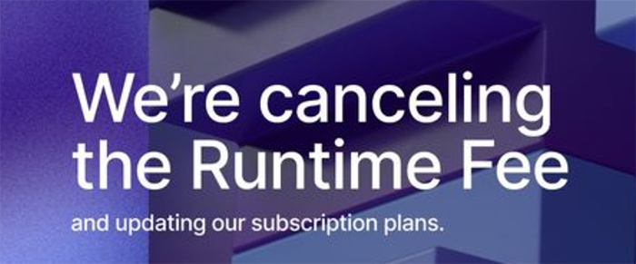
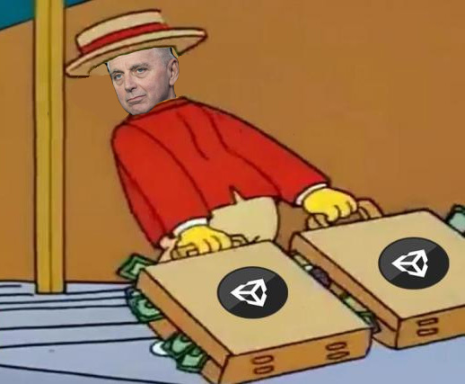
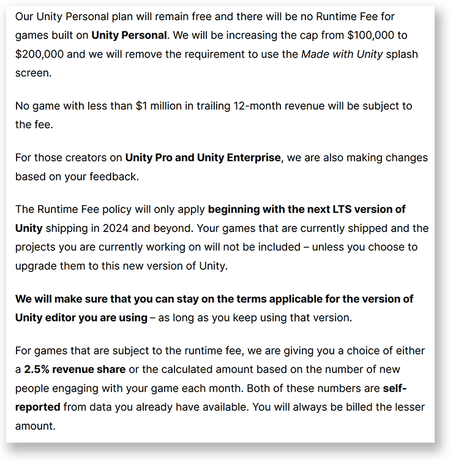
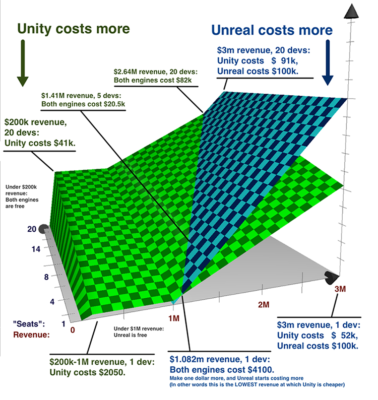
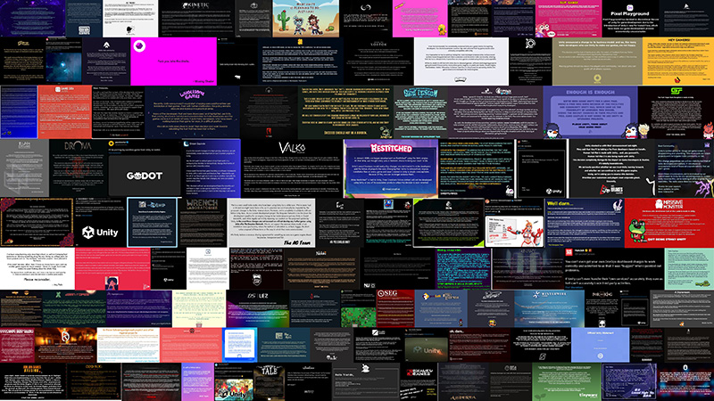
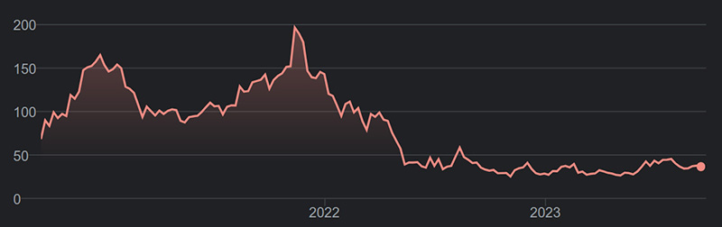
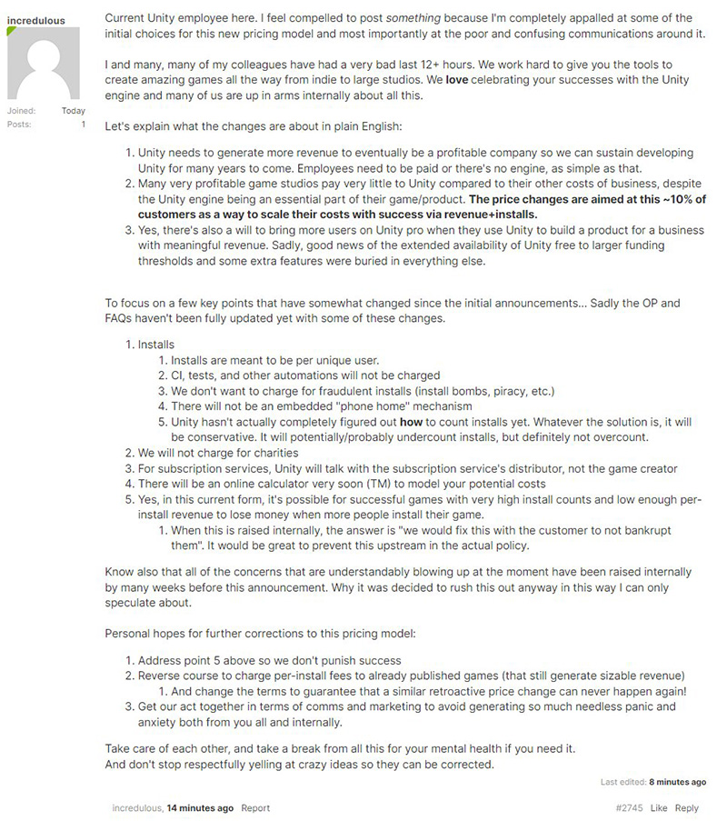
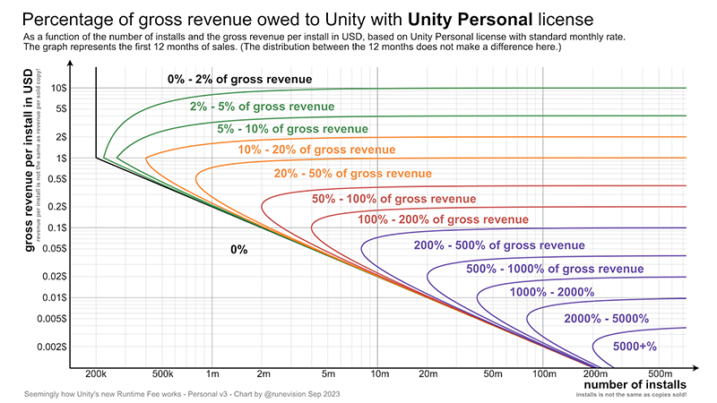
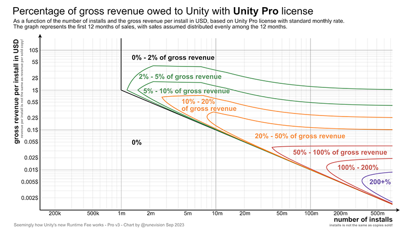
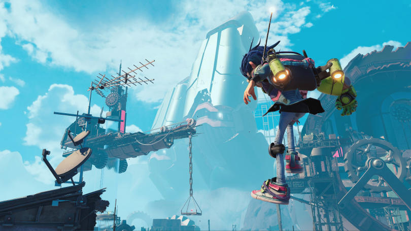


**UPDATE (12/09/2024)**







Although the damage is done, [Unity finally cancels the controversial Runtime Free](https://unity.com/blog/unity-is-canceling-the-runtime-fee).




**UPDATE (01/04/2024)**







[Unity appoints Matthew Bromberg as new CEO](https://investors.unity.com/news/news-details/2024/Unity-Appoints-Matthew-Bromberg-as-New-CEO/default.aspx). A bummer, in my opinion, as I believe that the measures taken by the previous interim CEO, [James Moon Whitehurst](https://en.wikipedia.org/wiki/Jim_Whitehurst), were going in the right direction: focus on the 3D engine and the editor.

It's still too early to tell if the [new CEO](https://www.linkedin.com/in/matthew-bromberg-79836b13/) will follow that path or not, but coming from Zynga, EA Mobile and being an advisor to Blackstone, I think we lose out with the change.



**UPDATE (10/10/2023)**

Today it was [announced](https://investors.unity.com/news/news-details/2023/Unity-Announces-Leadership-Transition/default.aspx) that [John Riccitiello](https://en.wikipedia.org/wiki/John_Riccitiello) is stepping down from all of his positions at Unity: President, CEO, Chairman and member of the board of directors.







[James Moon Whitehurst](https://en.wikipedia.org/wiki/Jim_Whitehurst) will serve as interim CEO. Whitehurst is a former president of IBM and CEO of Red Hat, and is currently a '_Special Advisor_' at [Silver Lake](https://en.wikipedia.org/wiki/Silver_Lake_(investment_firm)), which owns 10% of Unity.

Let's take a look at the current leadership of Unity:

* [James Moon Whitehurst](https://en.wikipedia.org/wiki/Jim_Whitehurst), interim CEO.
* [Tomer Bar-Zeev](https://www.linkedin.com/in/tomerbarzeev/), [Marc Whitten](https://www.linkedin.com/in/marcwhitten/): presidents.
* [Luis Felipe Visoso](https://www.linkedin.com/in/luis-felipe-visoso-aa841a22/), CFO.
* [Luc Barthelet](https://www.linkedin.com/in/marcwhitten/), CTO.
* [Carol Carpenter](https://www.linkedin.com/in/carolwcarpenter/), [Scott Pitasky](https://www.linkedin.com/in/scott-pitasky-4999891/), [Anirma Gupta](https://www.linkedin.com/in/anirmagupta/), [Clive Downie](https://www.linkedin.com/in/clive-downie-2003b07/), [Jessica Lindl](https://www.linkedin.com/in/jessica-lindl-8b73a5/): Vice presidents.

I think all of us who use Unity every day are happy to see Riccitiello leave. I would say it's a big step towards regaining lost confidence but seeing Tomer Bar-Zeev as president stops me from thinking so. Let's remember that he is the founder of one of the most hated malware companies and _possibly_ one of the precursors along with Riccitiello of the changes in Unity's business model. It is a pity that the purge stops only at Riccitiello.

If someone from the board members can refloat the ship, it's Whitehurst. During IBM's acquisition of Red Hat, he built a good reputation.

Hopefully the next CEO will have some background in the software industry and understand that **selling to game developers is very different than selling games**.



**UPDATE (22/09/2023)**

After almost a week of silence from Unity, they have [finally released](https://blog.unity.com/news/open-letter-on-runtime-fee) the following today:

That in summary:

* You can use the free version, Unity Personal, if your profits are less than **$200,000** (previously $100,000).
* The splash screen 'Made with Unity' requirement **is eliminated**.
* Unity versions prior to 2024 are **not subject to the change in pricing policy**.
* Games earning **more than $1,000,000** in the last 12 months will pay whichever is less:
  * **2.5% of profits**.
  * A figure calculated according to the number of new installations each month.
* Both the earnings and the number of installations will be **reported by the developer himself**.

**So similar to the Unreal model**, but with these differences:

These changes solve what for me were the two main problems with the new payment plan:

* It is **no longer retroactive**. The TOS will be that of the version of Unity you use.
* The information on the number of new installations will be **provided by the developer, not by a Unity "algorithm"**.

Although the damage to trust with Unity has already been done, it is a step in the right direction. We'll see what the future holds...


## What is going on?

If you use the Unity game development engine, you are probably aware of the radical, and controversial, change in their [pricing plans](https://blog.unity.com/news/plan-pricing-and-packaging-updates).

To summarize, they are the following points:

* The **'Unity Plus' plan will be discontinued**. Current subscribers will receive an offer to upgrade to the '**Unity Pro**' plan for **one year** at the '**Unity Plus**' price.
* Pricing plans will be '**Unity Personal**' (free[^1]), '**Unity Pro**' (~$2000/year/seat) and '**Unity Enterprise**' (?) (the '**Unity Industry**' plan is not mentioned).
* The '**Unity Runtime Fee**', a charge for each installation of the game billed monthly, is introduced.

[^1]: _Only if you earn less than $200,000 (net) per year._

## Unity Runtime Fee

The '**Unity Runtime Fee**' is a fee to be paid by the developer for each installation of his game made with Unity. **BOTH** conditions must be met for this to apply:

  * Your game exceeds a certain **number of installations**.
  * Your **net income** in the last twelve months exceeds a certain number.

Only when **both conditions** are met, this payment applies. And only for installations that exceed the limit number of installations. If you only exceed the limit in one installation, you would only pay for that extra installation.

The limit of installations depends on the plan you have:

  * '**Unity Personal**' and '**Unity Plus**': **200000**.
  * '**Unity Pro**' and '**Unity Enterprise**': **1000000**.

The same as the net income limit:

  * '**Unity Personal**' and '**Unity Plus**': **$200,000** (USD).
  * '**Unity Pro**' and '**Unity Enterprise**': **$1,000,000** (USD).

And finally, if you meet these two conditions, the price to pay for installation will depend on the country where it is installed. If it is **not from an '_emerging market_'**[^2]:

  * '**Unity Personal**' and '**Unity Plus**': **$0.20** (USD) per new install.
  * With '**Unity Pro**' will depend on each new installation, which exceeds the limit, per month:
    * 000001 - 100000: **$0.15** (USD) per new install.
    * 100001 - 500000: **$0.075** (USD) per new install.
    * 500001 - 1000000: **$0.03** (USD) per new install.
    * 1000001+: **$0.02** (USD) per new install.
  * With '**Unity Enterprise**', will depend on each new installation, which exceeds the limit, per month:
    * 000001 - 100000: **$0.125** (USD) per new install.
    * 100001 - 500000: **$0.06** (USD) per new install.
    * 500001 - 1000000: **$0.02** (USD) per new install.
    * 1000001+: **$0.01** (USD) per new install.

If the installation occurs in a '*emerging market*'[^2]:

  * '**Unity Personal**' and '**Unity Plus**': **$0.02** (USD) per new install.
  * '**Unity Pro**': **$0.01** (USD) per new install.
  * '**Unity Enterprise**': **$0.005** (USD) per new install.

Finally, some exceptions. The '**Unity Runtime Fee**' will not be paid for games that:

* Use WebGL or streaming.
* Games using gaming subscription services.
* Charity bundles.
* Reinstalls of the same game, on the same device (on different devices, **counts as a new installation**).
* Pirate installations or '_install bombing_' (how Unity will detect this is a mystery).
* Demos of games that do not have the complete content (_early access_ are not considered demos).
* Subscription-based games as Apple Arcade, Xbox Game Pass, PlayStation Plus, etc (Unity plans to be paid by the service?).

You are also eligible for a price reduction if you use Unity services such as '[Unity Gaming Services](https://unity.com/solutions/gaming-services)' or '[Unity LevelPlay](https://unity.com/unity-ads-ironsource)'.

[^2]: _According to Unity, these are **not emerging markets**: United States, Australia, Austria, Belgium, Canada, Denmark, Finland, France, Germany, Ireland, Japan, Netherlands, New Zealand, Norway, Sweden, Switzerland, South Korea, and the United Kingdom. All the rest are._

It's all very simple, isn't it? Now comes the **best part**...

## Retroactive

**Unity silently removed** their [GitHub repo](https://github.com/Unity-Technologies/TermsOfService) (404) to track license changes, then updated a **new license** to remove the clause that lets you use the TOS from the version you shipped with.

As of January 1 2024, **no matter what version** of Unity you make your game with, if you meet the requirements, you will have to pay the '**Unity Runtime Fee**'.

[Is this legal?](https://www.egdf.eu/egdf-unitys-install-fees-are-a-sign-of-looming-game-engine-market-failure/) I guess we will know very soon.

## Community reaction

Thanks to poor communication from Unity, the majority reaction has been [total](https://garry.net/posts/unity-can-get-fucked) [rejection](https://twitter.com/FuckedByUnity), misinformation, calls for a [boycott](https://mobilegamer.biz/unity-boycott-begins-as-devs-switch-off-ads-to-force-a-runtime-fee-reversal/), calls for its CEO to resign, many [m](https://twitter.com/fronkongames/status/1701929824128770467)[e](https://twitter.com/fronkongames/status/1701933277236383763)[m](https://twitter.com/fronkongames/status/1702277729410785688)[e](https://twitter.com/fronkongames/status/1702360626536833108)[s](https://www.reddit.com/r/Unity3D/comments/16iz63g/goodbye_my_darling_you_were_taken_too_soon/), hatred and even [death threats](https://www.bloomberg.com/news/articles/2023-09-14/video-game-company-unity-closes-offices-following-death-threat)[^3].

[^3]: In the end, it seems that they were [false](https://www.polygon.com/23873727/unity-credible-death-threat-offices-closed-pricing-change).

It also did not help to know that its CEO [John Riccitiello](https://en.wikipedia.org/wiki/John_Riccitiello) sold, days before changing the payment plans, [2000 shares of Unity](https://finance.yahoo.com/news/unity-software-incs-president-ceo-050515124.html). Shares that today are worth -47% of their original [IPO](https://venturebeat.com/business/unity-technologies-raises-more-than-1-1-billion-in-ipo-at-12-1-billion-valuation/) value.

And not only the community is pissed, but also the Unity engineers, whose superiors don't seem to care much about what they think:

## How it affects us

If you use Unity, the situation is worrying. But not for the reasons you think. The '**Unity Runtime Fee**' will have a negative economic impact on:


{.h2}

Or to put it another way, F2P with only advertising revenue. Is it a coincidence that if you use '[Unity LevelPlay](https://unity.com/unity-ads-ironsource)' (formerly [Iron Source](https://unity.com/unity-ads-ironsource)), Unity's advertising service, you can receive a discount on '**Unity Runtime Fee**'? 🤔

Is this an attempt to kill [AppLovin](https://www.applovin.com/)? 🤔

Does it have anything to do with AppLovin trying to [buy Unity for $20 billion](https://www.cnbc.com/2022/09/12/applovin-abandons-effort-to-buy-unity-after-20-billion-bid-rejected.html)? 🤔

What does the CEO of AppLovin [think about this](https://www.applovin.com/blog/my-views-on-the-unity-price-change/)? 🤔

Whatever Unity's reasons are for this change, I really believe that the vast majority of developers will not be affected. For those that do, many will still pay less than if they were using [Unreal Engine](https://www.unrealengine.com/en-US/faq) (which has no royalties up to $1000000, after that you pay 5%).

Let's see it with these graphs[^4], first for using '**Unity Personal**' and '**Unity Plus**':

[^4]: [Source](https://blog.runevision.com/2023/09/charts-to-visualize-how-much-you-owe.html).

And this one for '**Unity Pro**'.

* Most of us are in the 0% zone (according to Unity about 90%) 🥲.
* If you earn more than $200,000 net, it makes sense for you to upgrade to the '**Unity Pro**' plan.
* If you are in the 0% to 5% zone, and you are not thinking about developing your own technology or using [open source alternatives](https://godotengine.org/), it is not worth changing if you are happy with Unity.
* If you are outside the above zones, evaluate the costs of migrating your technology or creating your own. Perhaps you should also evaluate your business model.

## Timeline

Before I tell you my conclusions, let's take a look at a timeline with the highlights of the Riccitiello era.



Almost 20 acquisitions of companies in 10 years. Most of them, in my opinion, were unnecessary or unjustifiable other than to satisfy shareholders' desire for growth.

## My conclusions



I have been using Unity [professionally](https://github.com/FronkonGames) since version 4. With Unity I have developed games for PC, mobile and consoles. I've been [selling assets in their store](https://assetstore.unity.com/publishers/62716) for almost 10 years.

I have co-founded two game companies and as CTO I have chosen Unity as our technology. I'm even [developing a game](../../projects/kairos/) right now using Unity.

**I like Unity** for being able to use C#, the customization of its Editor, its asset store, the speed of prototyping and its huge community.

But I would say Unity is a harsh mistress, especially after its IPO.

For me, the **worst thing** that has happened in these 10 years is the chaos generated by the '**Scriptable Render Pipeline**', an interesting idea carried out in the worst possible way:

* Incompatible shader and rendering code between the three existing SRPs.
* Failure to upgrade shaders with the Built-In renderer to another SRP.
* Lack of documentation.

Fortunately Unity is already working on ['Block Shaders'](https://forum.unity.com/threads/block-shaders-surface-shaders-for-srps-and-more-public-demo-now-available.1350497/), something similar to the old Surface Shaders. It has only taken 5 years of complaining.

The other unforgivable mistake is the cancellation of ['Gigaya'](https://unity.com/demos/gigaya). Unity needs to develop games to offer better solutions and better pipelines to its customers, something Epic has been doing for years with Unreal. 'Gigaya' was going to be the first full game (not tech demo or scripted) of Unity, but someone decided to cancel it and fire the whole team.

And now we have to add the retroactive change, without warning, hiding it and possibly illegal of its TOS. This is something that I think is **much more serious** than the 'Unity Runtime Fee' and that finishes sinking the confidence of the companies with Unity.


{.h3}

I really doubt that Unity will still be around in 5 years as it is today if it continues on this course with John Riccitiello.

**Personally, I will continue to use Unity** as a large majority of my current income comes from its [Asset Store](https://assetstore.unity.com/publishers/62716), something in which it far surpasses its competition. The game I am developing is **not affected** by the 'Unity Runtime Fee' as it will not be F2P.

I just hope Unity comes to its senses, stops buying companies to fatten its stock market value (which is not happening) and **John Riccitiello resigns**.