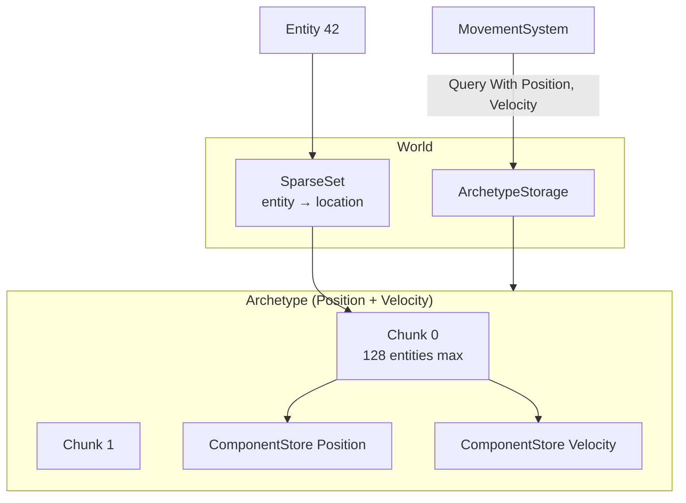
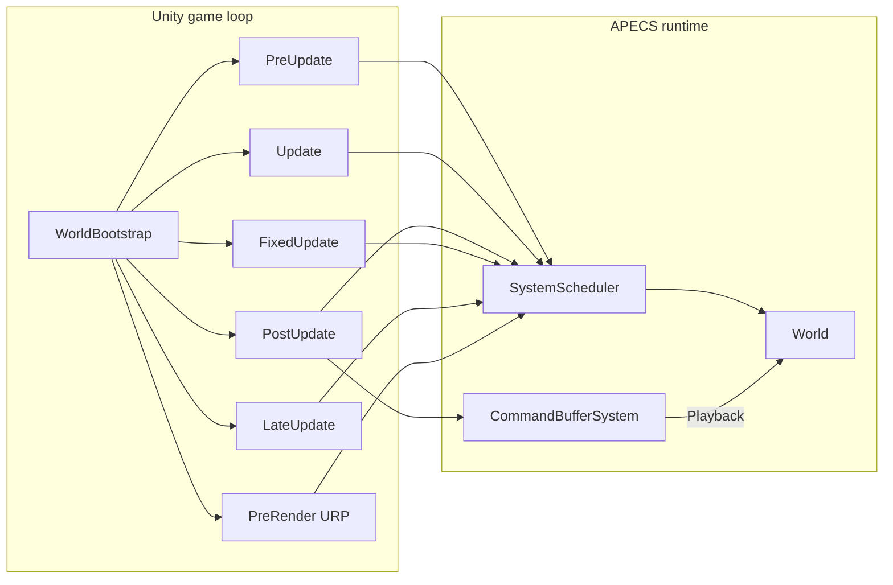

A **Entity Component System** (ECS) for Unity 6.3 that gives you **archetype storage**, **chunked components**, **type-safe queries**, **deferred command buffers**, **transient events** and a **Burst-friendly system scheduler**, all **without** the DOTS dependency.

- **Archetype chunk storage**: Each unique `ComponentMask` is a chunk of `NativeArray<Entity>` and one `NativeList<T>` per component type. The spec is followed precisely (Bevy-like). Memory is allocated once per archetype and reused as entities move between archetypes.
- **256 component types max**: `ComponentMask` is a single `fixed ulong[4]` (a `readonly struct` with `[StructLayout(LayoutKind.Sequential)]`), the 256-bit cap matches the spec exactly and keeps the mask check branchless.
- **Type-safe queries**: `QueryBuilder.With<T>().Without<U>().WithAny<A,B>().Build<T...>()` returns a `ref struct QueryIterator<T...>` that walks archetypes, chunks, then rows. `ref` access into components (no defensive copies) and a `Count` / `MatchingArchetypeCount` snapshot — all with structural-version checks that throw on mutations during iteration.
- **Deferred command buffers**: `CommandBuffer` records `CreateEntity` / `AddComponent` / `RemoveComponent` / `SetComponent` / `DestroyEntity` / `DestroyEntitiesWith<T>` and is played back by a `CommandBufferSystem` at the end of `Phase.PostUpdate`. Provisional entities (created in the same buffer, used in subsequent commands within the buffer) use the high bit of `Entity.Index` as a marker and are resolved to real entities on `Playback`.
- **Transient events**: `EventQueue<T>` is double-buffered. `EventWriter<T>.Send` is one-frame-latent; `SendImmediate` is the same-frame escape hatch. Readers drain via `EventReader<T>` (foreach, `AsNativeArray` for jobs, `Count`, `MoveNext` / `Current`).
- **Reflection is startup-only**: system discovery, attribute reads (`[UpdateInPhase]`, `[UpdateAfter]`, `[UpdateBefore]`, `[DisableByDefault]`), and `ComponentRegistry.IdOf<T>()` all run during `SystemScheduler.Initialize` and `WorldBootstrap.Awake`. The hot path reads only cached lists/dicts. No reflection in `Tick` or `Update` or `MoveNext`.
- **Burst + Jobs + URP**: jobs (`IJobParallelFor`, `IJob`) for the heavy lifting; `Graphics.DrawMeshInstanced` for the rendering sample; `RenderPipelineManager.beginContextRendering` for the URP-native PreRender hook.
- **85 EditMode tests pass** (7 phases: Foundations, Single-Archetype Storage, Multi-Archetype + Queries, System Scheduler, Command Buffer, Events, Integration Benchmarks).

#### What Is an ECS?

An **Entity Component System** (ECS) separates *what exists* (entities), *what data it carries* (components), and *what logic runs on that data* (systems). Instead of deep inheritance trees or fat `MonoBehaviour` classes that mix transform, health, AI, and rendering in one object, an ECS stores each concern as a small **unmanaged struct** and runs **systems** that iterate matching entities in tight loops.

That layout is **data-oriented**: components of the same type live contiguously in memory (Structure of Arrays), so a system that updates 50,000 velocities reads a sequential buffer, friendly to CPU caches and easy to hand off to **Burst** jobs. Gameplay code becomes "for every entity that has `Position` and `Velocity`, update position" rather than "for every `EnemyController`, call `Update()`."

**Core concepts in APECS:**

| Concept | Role |
|---|---|
| **World** | Root container: entities, archetypes, resources, events, command buffers. |
| **Entity** | Lightweight handle (`index + generation`). Not an object, just an ID into storage. |
| **Component** | Plain `unmanaged struct` (e.g. `Position`, `Health`). No behaviour, only data. |
| **Archetype** | All entities with the *same* set of component types share one archetype and one memory layout. |
| **Chunk** | Fixed-size block (128 entities) inside an archetype; components are stored as `NativeList<T>` slices. |
| **System** | Logic that runs each frame (or fixed step) on a subset of entities, usually via a **query**. |
| **Query** | Filter + iterator: "all entities with `A` and `B` but not `C`." |



**Why not classic Unity components?** A `MonoBehaviour` per object allocates managed memory, scatters fields across the heap, and virtualizes `Update()` per instance. At scale (tens of thousands of agents or particles), that cost dominates. ECS inverts the loop: one system, one hot path, thousands of entities processed with predictable memory access. APECS still **coexists** with MonoBehaviours, `WorldBootstrap` is a normal component that ticks systems from Unity's game loop; you choose how much of the project lives in ECS vs traditional scripts.

#### What Sets APECS Apart?

**APECS** stands for **A**rchetypal **P**arallel **E**ntity **C**omponent **S**ystem. Compared to other ECS approaches you might know:

| | **APECS** | **Unity DOTS / Entities** | **Entitas / LeoECS (C#)** |
|---|---|---|---|
| **Dependency** | `Burst`, `Collections`, `Jobs` only | Full `com.unity.entities` stack | Pure C#, no Unity native deps |
| **Storage** | Archetype chunks, `NativeList<T>` per type | Archetype chunks, blob/baking pipeline | Custom sparse sets / indexes |
| **Bootstrap** | `WorldBootstrap` `MonoBehaviour` | Subscenes, baking, default worlds | Your own host loop |
| **Queries** | `ref struct QueryIterator`, up to 8 components | `SystemAPI.Query`, source generators | Generated matchers / filters |
| **Structural changes** | `CommandBuffer` + end-of-phase flush | `EntityCommandBuffer`, system ordering | Framework-specific buffers |
| **Learning curve** | Single asmdef, ~30 runtime files | Large package, many concepts | Varies by port |

What is distinctive about APECS specifically:

- **Fixed 256-type cap**: `ComponentMask` is four `ulong`s (`fixed ulong[4]`). Mask tests are branchless; no dynamic bitsets on the hot path.
- **Generational entities**: destroying an entity bumps its generation; stale handles fail `IsAlive` without touching freed memory.
- **Structural version guard**: query iterators snapshot `World.StructuralVersion` and throw if the world mutates mid-iteration, pushing you toward deferred `CommandBuffer` usage.
- **Provisional entities**: commands recorded in the same buffer can reference entities not yet created; `Playback` resolves them in order.
- **Transient double-buffered events**: `EventWriter` / `EventReader` with one-frame latency by default; `SendImmediate` for same-frame escape hatches.
- **Reflection only at startup**: system discovery, attribute ordering, and `ComponentRegistry.IdOf<T>()` run once in `Initialize`; `Tick` and query iteration use cached lists only.



The design goal is a **small, readable codebase** you can read in an afternoon.

#### Why Not Use Unity DOTS?

Unity **DOTS** (Data-Oriented Technology Stack) centers on the **`com.unity.entities`** package: baked subscenes, entity hierarchies, blob assets, netcode ghosts, source-generated systems, and deep integration with the Entities editor workflow. It is the right choice when you are building a **DOTS-first** project and want Unity's long-term data-oriented roadmap (NetCode, ECS authoring, conversion pipelines).

**APECS deliberately does not depend on Entities**. It targets a different trade-off:

| Topic | Unity DOTS / Entities | APECS |
|---|---|---|
| **Package surface** | `entities`, `entities.graphics`, baking, etc. | One asmdef: `FronkonGames.APECS` |
| **Authoring** | Subscenes, bakers, `IComponentData` authoring components | Code-first: `RegisterStoreFactory<T>()`, masks at bootstrap |
| **World lifetime** | Default injection worlds, `WorldFlags`, conversion | Explicit `World` + optional `WorldBootstrap` in scene |
| **Queries** | `SystemAPI`, `IJobEntity`, codegen | Hand-written `QueryBuilder` → `ref struct` iterator |
| **Rendering** | Entities Graphics, batching, material meshes | Bring your own (`Graphics.DrawMeshInstanced`, URP hooks) |
| **Networking** | NetCode for Entities | Not included (local simulation only) |
| **Migration cost** | High if project is MonoBehaviour-heavy | Low: add package, one bootstrap object, migrate hot paths incrementally |

**Choose Unity DOTS when** you need official baking/subscenes, Entities Graphics, NetCode or you are committing to Unity's ECS authoring tools for the whole project.

**Choose APECS when** you want archetype storage and Burst-friendly iteration **without** pulling in `com.unity.entities`, when you prefer a **transparent, short implementation** you can extend or fork or when you need ECS for **one subsystem** (particles, crowds, simulation) inside an otherwise classic Unity project.

Both can use **Burst**, **Jobs** and **`NativeArray`**. APECS is not "anti-performance"; it is **anti-lock-in** to the full Entities ecosystem. You keep Unity's familiar `Update` / `FixedUpdate` / URP render callbacks. APECS systems plug into those phases via `[UpdateInPhase]` instead of replacing Unity's player loop entirely.

#### What Can Be Used For

- **Data-oriented game architecture** for Unity projects that need ECS without committing to DOTS / Entities package.
- **High-throughput simulations** — particles, agents, boids — running into the hundreds of thousands on mid-range hardware thanks to chunked archetypes and Burst-compiled jobs.
- **Custom engines inside an existing Unity project** — APECS ships as a single asmdef (`FronkonGames.APECS`) and doesn't replace the standard MonoBehaviour loop; `WorldBootstrap` is a regular `MonoBehaviour` that ticks systems from the Unity game loop.
- **URP / Built-in / HDRP compatible** — the package is render-pipeline agnostic; sample code in `Samples~/ParticleSimulation/` uses `Graphics.DrawMeshInstanced` for one-draw-call rendering.
- **Teaching / learning ECS** — the codebase is short, fully tested, and the design follows the public spec (`DEVELOPMENT.md`) closely. Easy to read top-to-bottom.

#### What Is NOT

- **DOTS / `com.unity.entities`**. The `Packages/manifest.json` deliberately does not include `com.unity.entities`. Everything is `Unity.Collections` / `Unity.Mathematics` / `Unity.Jobs` / `Unity.Burst` only. If you want Entities' archetypes, jobs, baking, or scene conversion, use Entities.
- **A job system library** — APECS uses Unity's `Unity.Jobs` (`IJob`, `IJobParallelFor`, `IJobParallelForBatch`) but doesn't abstract them. If you want a more sophisticated job graph, look at `com.unity.jobs` or Entities' system update group.
- **A scene baking / subscene pipeline**. There is no Editor-side baking; archetypes are created lazily on the first `world.CreateEntity(mask)` call. The user defines masks manually (typically at bootstrap time).
- **A networking solution**. Single-process only — there is no serialisation, no RPCs, no ghost replication. The system intentionally stops at "fast deterministic local simulation".
- **A visual / editor / inspector framework**. No custom inspector, no scene gizmos, no Entity Debugger. The two `Samples~/` projects show how to render (URP `DrawMeshInstanced`) and to spawn agents, but rendering is your responsibility.

## Installation

Requirements:

* Unity 6000.3 LTS or newer.
* The `FronkonGames.APECS` package already includes the URP render pipeline integration. The package works with the URP, Built-in, and HDRP render pipelines (no render-pipeline-specific code in the runtime).

Installation (as a local package in this repo):

1. Open this repository as a Unity project.
2. The `Assets/FronkonGames/APECS/` folder is the runtime source. The asmdef (`FronkonGames.APECS.asmdef`) is already configured with `allowUnsafeCode: true` (needed for the `fixed ulong Mask[4]`), and the `Tests/` folder has a separate `APECS.Tests.asmdef` that's only included in test mode.
3. To consume APECS from a *different* Unity project, add the line below to that project's `Packages/manifest.json` and Unity will pick it up on the next refresh:
   ```json
   "com.fronkongames.apecs": "file:../../path/to/APECS"
   ```
4. No additional setup is required — the package is ready to use out of the box.

## How To Use

The `WorldBootstrap` component is the central entry point. It owns the `World`, the `SystemScheduler`, the `CommandBufferSystem`, the `WorldTime` resource, and a `Resources` container; it hooks into the Unity game loop and the URP render loop to tick systems on the right phase.

Create an empty GameObject and add the `WorldBootstrap` component (Fronkon Games  APECS  World Bootstrap).

### World

A **`World`** is the top-level ECS container for one simulation. It holds every live entity, every archetype and chunk, shared resources, event queues, and the link to the command-buffer flush system.

You typically create one world per game session (or one per logical simulation). `WorldBootstrap` creates it for you in a scene, or you can construct it manually.

Use the world to **register component types**, **spawn and destroy entities**, **read and write components**, **run queries**, and **coordinate systems**. Nothing in APECS stores entity data outside a world, if you need two independent simulations (e.g. main game + replay), use two worlds.

```csharp
using FronkonGames.APECS;
using Unity.Mathematics;

World world = new World("MyGame");

// Register a component factory once, at bootstrap. Required for every T that
// will appear in any archetype mask, the storage subsystem uses these to
// materialise a fresh IComponentStore for a new archetype.
world.RegisterStoreFactory<Position>();
world.RegisterStoreFactory<Velocity>();
world.RegisterStoreFactory<Health>();
```

## Systems

In ECS, a **system** is a unit of behaviour: code that runs once per tick and operates on entities matching a query. Systems do not own entity data, they read and write **components** stored in the **world**. APECS systems implement **`ISystem`** or inherit **`SystemBase`**, are tagged with **`[UpdateInPhase]`**, and are ticked by **`SystemScheduler`** (via **`WorldBootstrap`**) on Unity's update loop.

The subsections below walk through what systems use every frame: creating entities, reading and writing components, iterating with **queries**, deferring **structural changes**, and passing **events**. Further down you will find the full **runtime API reference** for each type (`World`, `Entity`, `ComponentMask`, and the rest).

```csharp
using FronkonGames.APECS;
using Unity.Mathematics;

// Discovered automatically when [UpdateInPhase] is present and autoDiscoverSystems = true.
[UpdateInPhase(Phase.Update)]
public sealed class MovementSystem : SystemBase
{
  protected override void Update()
  {
    // Query all entities with Position + Velocity; mutate components in place.
    var iter = Query()
      .With<Position>()
      .With<Velocity>()
      .Build<Position, Velocity>();

    while (iter.MoveNext())
    {
      ref Position p = ref iter.Current.t;
      ref Velocity v = ref iter.Current.u;
      p.Value += v.Value * DeltaTime;
    }

    // Do not DestroyEntity or AddComponent here while iter may still be open.
    // Record structural work into Commands — flushed at Phase.PostUpdate.
    // Commands.DestroyEntity(dead);
  }
}
```

### Entities

An **entity** is a lightweight ID (`index + generation`), not a class instance. Creating one allocates a slot in the world's `SparseSet` and places it in the **archetype** that matches the **component mask** you pass in, the set of component types that entity will have. The mask defines the memory layout, all entities with the same mask share one archetype and are stored together in chunks for cache-friendly iteration.

Call `world.CreateEntity(mask)` when you need a new object in the simulation. The first use of a mask **lazily creates** the archetype and its component stores (which is why you must `RegisterStoreFactory<T>()` for every type in the mask beforehand).

To remove an entity, call `world.DestroyEntity(e)`, the handle becomes stale immediately because the generation bumps.

```csharp
// Create an entity in a specific archetype. Lazily materialises the archetype
// (and its component stores) on first use.
var e = world.CreateEntity(ComponentMask.Of<Position, Velocity>());

// Or, with an existing mask:
ComponentMask moving = ComponentMask.Of<Position, Velocity, Health>();
var e2 = world.CreateEntity(moving);
```

### Add And Read Components

**Components** are plain `unmanaged struct`s, data only, no behaviour. Each entity carries the component types defined by its archetype mask; you can read and write them through the world as long as the entity is alive and actually has that type.

Use **`SetComponent`** to write a value, **`GetComponent`** to read a copy, and **`GetComponentRef`** when you want to mutate in place without allocating or copying (the usual choice in hot loops).

**`HasComponent`** checks membership without throwing. **`IsAlive`** validates the entity handle first.

Writing a component the entity does not have throws, add it with **`AddComponent`** (a structural change that migrates the entity to a new archetype) instead of `SetComponent`.

```csharp
world.SetComponent(e, new Position { Value = new float3(0, 0, 0) });
world.SetComponent(e, new Velocity { Value = new float3(1, 0, 0) });

// GetComponent returns a copy. For read-only access through a ref, use GetComponentRef.
ref Position p = ref world.GetComponentRef<Position>(e);
p.Value += float3.zero; // mutate in place, no copy

// Multi-component batched read on the same entity.
bool alive = world.IsAlive(e);
bool has = world.HasComponent<Health>(e);
```

### Query Entities

**Queries** are how systems process many entities at once. Instead of tracking entity lists yourself, you describe a **filter** (`With`, `Without`, `WithAny`) and APECS walks every matching **archetype** and **chunk**, yielding each live row with direct `ref` access to its components, no boxing, no per-entity dictionary lookups.

Start from `world.Query()`, chain filter rules, then call `Build<T...>()` with the component types you want to read or mutate (up to eight). The returned `QueryIterator` is a **`ref struct`**: stack-only, zero allocation, and safe to use in tight loops or to feed Burst jobs via `GetComponentArray`. Do not create or destroy entities, or add/remove components, while iterating, the iterator checks `StructuralVersion` and throws if the world changed mid-walk. Defer those changes to a `CommandBuffer` instead.

```csharp
// Build a query that matches archetypes containing Position + Velocity but not Health.
var iter = world.Query()
  .With<Position>()
  .With<Velocity>()
  .Without<Health>()
  .Build<Position, Velocity>();

// foreach via the ref-struct enumerator. entry.t is `ref Position`, entry.u is `ref Velocity`.
while (iter.MoveNext())
{
  ref var p = ref iter.Current.t;
  ref var v = ref iter.Current.u;
  p.Value += v.Value * UnityEngine.Time.deltaTime;
}
```

`QueryEntry<T...>` exposes each requested component as a `ref`-typed property (`t`, `u`, `v`, `w`, `x`, `y`, `z`, `a` for 1-8 components respectively). Use these directly in the inner loop body — no copy, no array indexing.

### Defer Structural Changes

**Structural changes** alter the shape of the world: creating or destroying entities, or adding/removing component types (which moves an entity to a different archetype). Each one bumps `StructuralVersion` and can invalidate open query iterators. Mutating structure **while** iterating is therefore unsafe — record the work instead and apply it later.

A **`CommandBuffer`** queues those mutations as ordered commands. Systems obtain their own buffer via `CommandBufferSystem.GetBuffer(this)` (or `Commands` on `SystemBase`). Commands recorded in the same buffer can reference **provisional entities** created earlier in that buffer; `Playback` resolves them to real handles before applying the rest. By default, **`CommandBufferSystem`** flushes every buffer at the end of **`Phase.PostUpdate`**, so gameplay systems can iterate safely all frame and structural edits land in one consistent batch.

```csharp
// Systems that mutate structure during iteration should record into their Commands
// buffer, not the world directly. The CommandBufferSystem plays every buffer back
// at the end of Phase.PostUpdate.
var buffer = world.CommandBufferSystem.GetBuffer(this);
buffer.CreateEntity(ComponentMask.Of<Position, Velocity>());
buffer.DestroyEntity(e);
```

### Send And Read Events

**Events** are transient, typed messages between systems, spawn requests, damage notifications, input pulses, not long-lived component data. Each event type gets a double-buffered **`EventQueue<T>`** on the world.

Writers append to one side, at the start of the next **`Update`**, **`FixedUpdate`**, or **`LateUpdate`** tick the scheduler **swaps** buffers so readers drain what was sent last phase.

From a **`SystemBase`** subclass, use **`GetEventWriter<T>()`** to publish and **`GetEventReader<T>()`** to consume.

**`Send`** is the default: one frame of latency, safe when producer and consumer run in the same phase group.

**`SendImmediate`** writes straight to the readable buffer for same-frame delivery when you accept tighter coupling. Events are **not** stored on entities, if something must persist, use a component or a world resource instead.

```csharp
// Writer. Send is one-frame-latent (visible to next-phase readers). SendImmediate
// bypasses the buffer for same-frame use.
GetEventWriter<DamageEvent>().Send(new DamageEvent { Amount = 10 });
GetEventWriter<DamageEvent>().SendImmediate(new DamageEvent { Amount = 99 });

// Reader (one frame later in the next Update/FixedUpdate/LateUpdate tick, after
// the scheduler has called SwapAllEventQueues).
var reader = GetEventReader<DamageEvent>();
while (reader.MoveNext())
{
  DamageEvent evt = reader.Current;
  Debug.Log($"damage: {evt.Amount}");
}
```

### Snapshot The World

Sometimes you need a **read-only picture** of the simulation (for debug UI, tests or logging) without walking a typed query. The world exposes a few cheap counters and introspection hooks for that.

**`EntityCount`** is the number of live handles. **`StructuralVersion`** increments on every structural change, query iterators snapshot it at creation time and compare on each `MoveNext`, which is why this value is useful when debugging "iterator invalidated" errors.

**`ArchetypeStorage`** lists every materialised archetype with its mask, entity count, and chunk count — handy to verify that masks are splitting entities the way you expect. These APIs are for diagnostics and tooling; gameplay systems should prefer **`Query`** for iteration.

```csharp
// EntityCount / StructuralVersion are useful for sanity checks and for the
// "structural mutation during iteration" guard.
Debug.Log($"alive={world.EntityCount} version={world.StructuralVersion}");

// Iterate every archetype:
for (int a = 0; a < world.ArchetypeStorage.ArchetypeCount; a++)
{
  var arch = world.ArchetypeStorage.All[a];
  Debug.Log($"archetype {a}: mask={arch.Mask} entities={arch.EntityCount} chunks={arch.ChunkCount}");
}
```

### ComponentMask

A **`ComponentMask`** describes **which component types an entity has**. It is a 256-bit bitset (`fixed ulong[4]`), one bit per registered component type, stored as a small unmanaged struct. Every entity belongs to exactly one **archetype** per mask; entities that share the same mask are stored together in the same chunks.

You use masks when **creating entities** (`CreateEntity(mask)`), **building queries** (filters compare against archetype masks), and **recording command-buffer commands**. Factory helpers like `ComponentMask.Of<Position, Velocity>()` register types in **`ComponentRegistry`** on first use and set the corresponding bits. **`HasAll`**, **`HasAny`**, and **`HasNone`** compare masks in branchless word operations, useful inside query filters and custom matching logic. When you **`AddComponent`** or **`RemoveComponent`**, the world derives a new mask from the old one (`Set` / `Unset`) and migrates the entity to the matching archetype.

```csharp
using FronkonGames.APECS;

// Build from component types (registers each type in ComponentRegistry on first use).
ComponentMask moving = ComponentMask.Of<Position, Velocity>();
ComponentMask combat  = ComponentMask.Of<Position, Velocity, Health>();

// Or assemble manually from stable IDs.
ComponentMask custom = default;
custom.Set(ComponentRegistry.IdOf<Position>());
custom.Set(ComponentRegistry.IdOf<Velocity>());

// Membership tests between masks.
ComponentMask required = ComponentMask.Of<Position>();
ComponentMask excluded = ComponentMask.Of<Health>();

bool matches = moving.HasAll(required);   // true — moving includes Position
bool blocked = moving.HasAny(excluded);   // false — moving has no Health
bool clean   = moving.HasNone(excluded);  // true — no excluded types present

// Use when creating entities or recording commands.
Entity e = world.CreateEntity(ComponentMask.Of<Position, Velocity>());

// Derive a new mask (e.g. before AddComponent / RemoveComponent internally).
ComponentMask withHealth = moving;
withHealth.Set(ComponentRegistry.IdOf<Health>());

ComponentMask withoutVel = moving;
withoutVel.Unset(ComponentRegistry.IdOf<Velocity>());
```

### SparseSet

The **`SparseSet`** is the world's **entity table**. It maps each live entity index to a **generation** (for stale-handle detection) and an **`EntityRecord`** (archetype id, chunk index, row). When you call `world.CreateEntity`, the world allocates an ID from the sparse set and registers where that entity lives in archetype storage; every `GetComponentRef` lookup goes through this map first.

You rarely touch `SparseSet` directly in gameplay code, `World.IsAlive`, `CreateEntity`, and `DestroyEntity` wrap it. It is useful to understand for debugging, tests, and custom tooling. **`Create`** hands out reusable indices from a free list; **`Destroy`** bumps the generation so old handles fail **`IsAlive`** without freeing memory unsafely. Index **0** is reserved for **`Entity.Null`**.

```csharp
using FronkonGames.APECS;

SparseSet set = new SparseSet();

// Liveness: allocate an ID (generation starts at 1 for a fresh index).
Entity e = set.Create();                    // e.g. Entity(idx:1 gen:1)
Debug.Log(set.Count);                       // 1

// Location: where the entity lives inside its archetype (written by World).
set.Set(e, new EntityRecord
{
  ArchetypeId = 1,
  ChunkIndex = 0,
  Row = 0,
});

if (set.TryGet(e, out EntityRecord loc))
  Debug.Log($"archetype={loc.ArchetypeId} chunk={loc.ChunkIndex} row={loc.Row}");

// Destroy: generation bumps; stale copies of e no longer pass IsAlive.
Entity stale = e;
set.Destroy(e);
Debug.Log(set.IsAlive(stale)); // false
Debug.Log(set.IsAlive(e));     // false
```

### Archetype + ArchetypeChunk

An **archetype** is the storage bucket for all entities that share the same **component mask**. It owns one **`ComponentStore<T>`** per component type and a list of **`ArchetypeChunk`** blocks. An **`ArchetypeChunk`** is a fixed slab of up to **128** entities (`ArchetypeChunk.Capacity`), each row storing an **`Entity`** handle; matching component data for that row lives at the same index in each store (Structure of Arrays).

When the last chunk fills up, the archetype allocates another chunk and grows the stores. **`Add`** appends to the tail chunk; **`Remove`** uses **swap-back** (the last live row moves into the vacated slot) so arrays stay dense. You normally reach archetypes through **`world.ArchetypeStorage`** after **`CreateEntity`**, queries iterate them automatically; direct access is for debugging, jobs, or custom tooling.

```csharp
using FronkonGames.APECS;

// Two entities with the same mask share one archetype.
Entity a = world.CreateEntity(ComponentMask.Of<Position, Velocity>());
Entity b = world.CreateEntity(ComponentMask.Of<Position, Velocity>());

Archetype arch = world.ArchetypeStorage.All[0];
Debug.Log($"mask={arch.Mask} entities={arch.EntityCount} chunks={arch.ChunkCount}");

// Each chunk tracks dense entity rows [0..count).
ArchetypeChunk chunk = arch.Chunks[0];
Debug.Log($"chunk occupancy={chunk.count}/{ArchetypeChunk.Capacity} full={chunk.IsFull}");

// Component data for row r lives at (chunkIndex, row) in each store.
int posId = ComponentRegistry.IdOf<Position>();
var posStore = (ComponentStore<Position>)arch.GetStore(posId);
ref Position p = ref posStore.GetRef(chunkIndex: 0, row: 0);
p.Value += new float3(1, 0, 0);
```

### ArchetypeStorage

**`ArchetypeStorage`** is the world's **registry of archetypes**. It maps each distinct **`ComponentMask`** to one **`Archetype`** instance and assigns stable numeric IDs. Archetypes are **materialised lazily**: the first time a mask is used (via `world.CreateEntity` or `GetOrCreate`), storage creates the archetype and builds a **`ComponentStore<T>`** for every bit set in the mask using the factories you registered with **`RegisterStoreFactory<T>()`**.

Gameplay code usually goes through **`World`**, but `world.ArchetypeStorage` is the right entry point for introspection, custom iterators, and tests. **`GetOrCreate(mask)`** returns an existing bucket or allocates a new one. **`All`** lists every archetype in creation order; **`GetById`** resolves the ID stored in each entity's **`EntityRecord`**. As masks proliferate (many component combinations), archetype count grows, that is normal and expected.

```csharp
using FronkonGames.APECS;

// Creating entities implicitly calls GetOrCreate for each new mask.
Entity mover = world.CreateEntity(ComponentMask.Of<Position, Velocity>());
Entity static_ = world.CreateEntity(ComponentMask.Of<Position>());

ArchetypeStorage storage = world.ArchetypeStorage;
Debug.Log($"archetypes={storage.ArchetypeCount}");   // 2 distinct masks

// Lookup by mask (same instance on repeated calls).
ComponentMask moving = ComponentMask.Of<Position, Velocity>();
Archetype arch = storage.GetOrCreate(moving);
Debug.Log(arch.EntityCount);

// Lookup by stable id (from EntityRecord after CreateEntity).
if (world.SparseSet.TryGet(mover, out EntityRecord rec))
{
  Archetype byId = storage.GetById(rec.ArchetypeId);
  Debug.Log(byId.Mask.HasAll(moving));
}

// Walk everything (debug / benchmarks).
for (int i = 0; i < storage.ArchetypeCount; i++)
  Debug.Log(storage.All[i].EntityCount);
```

### IComponentStore + ComponentStore<T>

Each component type inside an archetype is backed by a **`ComponentStore<T>`**: a **`NativeList<T>`** laid out in **chunk-major order**. Row `j` in chunk `i` lives at index `i * ArchetypeChunk.Capacity + j`, so all `Position` values for a chunk sit contiguously in memory (Structure of Arrays). **`IComponentStore`** is the non-generic interface the archetype uses for **`GrowChunk`**, swap-back **`RemoveAt`**, and **`MoveToChunk`** during entity migration.

Normal gameplay goes through **`world.SetComponent`** / **`GetComponentRef`**, which resolve `(chunk, row)` via the sparse set. Reach stores directly when writing **Burst jobs** (`GetChunkArray` returns a `NativeArray<T>` slice sized to live rows), custom iterators, or archetype introspection. One store exists **per component type per archetype**, not per entity.

```csharp
using FronkonGames.APECS;
using Unity.Mathematics;
using Unity.Collections;

Entity e = world.CreateEntity(ComponentMask.Of<Position, Velocity>());
world.SetComponent(e, new Position { Value = float3.zero });

// Resolve store from the entity's archetype.
world.SparseSet.TryGet(e, out EntityRecord rec);
Archetype arch = world.ArchetypeStorage.GetById(rec.ArchetypeId);
var posStore = (ComponentStore<Position>)arch.GetStore(ComponentRegistry.IdOf<Position>());

// Random access by (chunk, row).
ref Position p = ref posStore.GetRef(rec.ChunkIndex, rec.Row);
p.Value.x += 1f;

// Dense slice for jobs: only live rows [0..chunk.count).
ArchetypeChunk chunk = arch.Chunks[rec.ChunkIndex];
NativeArray<Position> slice = posStore.GetChunkArray(rec.ChunkIndex, chunk.count);
// pass slice to IJobParallelFor, then dispose job dependencies as usual
```

### QueryBuilder + QueryFilter + QueryIterator<T...>

**Queries** are how systems find entities without hand-rolling archetype walks. **`QueryBuilder`** is a fluent struct that accumulates a **`QueryFilter`** (`With`, `Without`, `WithAny`, …). **`Build<T...>()`** returns a **`ref struct QueryIterator<T...>`** (1–8 component types) that walks every matching archetype and chunk in O(archetypes × chunks).

Each **`MoveNext()`** advances to the next entity; multi-component iterators expose one **`ref`** accessor per type parameter (`t`, `u`, `v`, …). **`MoveNext`** throws if **`StructuralVersion`** changed since the iterator was built — record structural work in a **`CommandBuffer`** instead of mutating the world mid-iteration.

```csharp
var iter = world.Query()
  .With<Position>()
  .With<Velocity>()
  .Without<Health>()
  .WithAny<SteeringTag, Wander>()
  .Build<Position, Velocity>();

while (iter.MoveNext())
{
  ref Position p = ref iter.Current.t;
  ref Velocity v = ref iter.Current.u;
  // mutate in place
}

int count = iter.Count;            // live count, re-walks the world
int archetypes = iter.MatchingArchetypeCount;
NativeArray<Position> arr = iter.GetComponentArray(archetypeIdx, chunkIdx);  // sized to Count, not Capacity
```

The multi-component iterator exposes one `ref`-typed accessor per generic parameter: `t`, `u`, `v`, `w`, `x`, `y`, `z`, `a`. `QueryEntry<T...>` is a `ref struct` that wraps these for `foreach`.

`QueryIterator.MoveNext` throws `InvalidOperationException` if the world `StructuralVersion` changed since iterator construction. This is the guard against mutations during iteration. Use a `CommandBuffer` if you need to mutate.

### CommandBuffer + CommandBufferSystem

A **`CommandBuffer`** records **deferred structural mutations**: create/destroy entities, add/remove components, set components, and bulk destroy by type. Commands are stored in order and applied later during **`Playback`**, which bumps **`StructuralVersion`** once at the end. That lets systems iterate queries safely and apply all spawns/despawns in one consistent batch.

**`CreateEntity`** returns a **provisional** handle (high bit set on `Entity.Index`). Later commands in the **same buffer** can reference it; playback resolves provisionals to real entities before running subsequent commands. From **`SystemBase`**, use the **`Commands`** property; each system gets its own buffer via **`CommandBufferSystem.GetBuffer(this)`**.

**`CommandBufferSystem`** is a normal system (default **`Phase.PostUpdate`**) that calls **`Playback`** on every registered buffer, then clears them. Assign it on the world (`world.CommandBufferSystem = ...`) before systems record commands, `WorldBootstrap` typically registers one for you.

```csharp
using FronkonGames.APECS;
using Unity.Mathematics;

[UpdateInPhase(Phase.Update)]
public sealed class SpawnSystem : SystemBase
{
  protected override void Update()
  {
    var iter = Query().With<Health>().Build<Health>();
    while (iter.MoveNext())
    {
      ref Health h = ref iter.Current.Component;
      if (h.Value <= 0)
        Commands.DestroyEntity(iter.Current.entity);  // deferred, not world.DestroyEntity
    }

    // Provisional entity: usable in subsequent commands in this buffer.
    Entity bullet = Commands.CreateEntity(ComponentMask.Of<Position, Velocity>());
    Commands.SetComponent(bullet, new Position { Value = float3.zero });
    Commands.SetComponent(bullet, new Velocity { Value = new float3(0, 0, 10) });
  }
}

// CommandBufferSystem (Phase.PostUpdate) runs after Update systems:
//   Playback(world) for each buffer → real entities created → buffers cleared.
```

Manual playback (tests/tools):

```csharp
CommandBuffer buf = new CommandBuffer(world);
Entity provisional = buf.CreateEntity(ComponentMask.Of<Position>());
buf.SetComponent(provisional, new Position { Value = float3.zero });
buf.Playback(world);   // applies to world, bumps StructuralVersion once
```

### EventQueue + EventWriter + EventReader

**Events** are short-lived, typed messages — spawn requests, damage pulses, input edges — not long-lived component data. Each event type **`T`** gets a double-buffered **`EventQueue<T>`** on the world (two **`NativeList<T>`** sides). **`EventWriter<T>`** appends to the write side; **`EventReader<T>`** drains the readable side.

From **`SystemBase`**, use **`GetEventWriter<T>()`** to publish and **`GetEventReader<T>()`** to consume. **`Send`** is the default: events stay in the write buffer until the next **`Swap`**, so readers typically see last phase's traffic. **`SendImmediate`** writes straight to the readable buffer for same-frame delivery when you accept tighter coupling.

The scheduler calls **`world.SwapAllEventQueues()`** at the start of **`Update`**, **`FixedUpdate`**, and **`LateUpdate`** only. **`PreUpdate`**, **`PostUpdate`**, **`PreRender`**, **`Initialization`**, and **`Teardown`** do not swap. Readers are stack-only **`ref struct`** iterators: use **`MoveNext()`** / **`Current`**, **`foreach`**, or **`AsNativeArray()`** for jobs. **`Current`** returns **`T`** by value — events are read-only once sent.

```csharp
public struct DamageEvent { public Entity Target; public float Amount; }

[UpdateInPhase(Phase.Update)]
public sealed class CombatSystem : SystemBase
{
  protected override void Update()
  {
    GetEventWriter<DamageEvent>().Send(new DamageEvent { Target = enemy, Amount = 25 });
  }
}

[UpdateInPhase(Phase.Update)]
[UpdateAfter(typeof(CombatSystem))]
public sealed class HealthSystem : SystemBase
{
  protected override void Update()
  {
    var reader = GetEventReader<DamageEvent>();
    while (reader.MoveNext())
    {
      DamageEvent evt = reader.Current;
      ref Health h = ref World.GetComponentRef<Health>(evt.Target);
      h.Value -= evt.Amount;
    }
  }
}
```

Direct queue access (tests, custom hosts):

```csharp
EventQueue<DamageEvent> queue = world.GetEventQueue<DamageEvent>();
queue.Send(new DamageEvent { /* ... */ });
queue.Swap();   // normally done by SystemScheduler at phase start
```

### SystemScheduler + SystemBase + ISystem

**`SystemBase`** is the usual starting point: it wires **`World`**, **`Query()`**, **`Commands`**, event accessors, and per-tick **`DeltaTime`** / **`FixedDeltaTime`**. Subclasses override **`Update()`** (and optionally **`OnInitialize()`** / **`OnShutdown()`**). **`ISystem`** is the minimal interface (`OnCreate`, `OnUpdate`, `OnDestroy`, **`Enabled`**) for types that should not inherit — struct systems, thin adapters, tests.

**`SystemScheduler`** registers systems and ticks them by **`Phase`**. With **`autoDiscover = true`**, it reflects loaded assemblies for **`[UpdateInPhase]`** types, reads **`[UpdateAfter]`** / **`[UpdateBefore]`** edges, topologically sorts with Kahn's algorithm, and invokes **`OnUpdate`** in order. Use **`Register<T>()`** / **`Register(ISystem)`** when discovery is off. Throws **`CircularDependencyException`** on dependency cycles.

Register **`CommandBufferSystem`** and assign **`world.CommandBufferSystem`** before any system uses **`Commands`** (auto-discovery picks it up like any other `[UpdateInPhase]` system).

```csharp
// Auto-discovered when WorldBootstrap.autoDiscoverSystems = true:
[UpdateInPhase(Phase.Update)]
[UpdateAfter(typeof(MovementSystem))]
public sealed class RenderPrepSystem : SystemBase
{
  protected override void OnInitialize()
  {
    // World is assigned; register caches, subscribe to resources, etc.
  }

  protected override void Update() { /* runs each Update tick */ }
}

// Manual host (tests, headless tools):
var world = new World();
var scheduler = new SystemScheduler();
scheduler.Initialize(world, autoDiscover: false);
scheduler.Register<CommandBufferSystem>();
world.CommandBufferSystem = scheduler.GetSystem<CommandBufferSystem>();
scheduler.Register<MovementSystem>();
scheduler.Tick(Phase.Update);
scheduler.Shutdown();
scheduler.Dispose();
```

Public scheduler surface:

```csharp
public sealed class SystemScheduler : IDisposable
{
  public void Initialize(World world, bool autoDiscover = true);
  public void Register<T>() where T : ISystem, new();
  public void Register(ISystem s);
  public void Unregister<T>() where T : ISystem;
  public T GetSystem<T>() where T : ISystem;
  public void Tick(Phase phase);
  public void Shutdown();
  public void Dispose();
}
```

### WorldBootstrap (URP-aware)

**`WorldBootstrap`** is a **`MonoBehaviour`** entry point that owns one **`World`** and one **`SystemScheduler`** for a scene. On **`Awake`** it creates the world, sets **`World.Default`**, optionally registers **`WorldTime`** as a resource, and initializes the scheduler. Unity callbacks drive phases: **`Update`** ticks **`PreUpdate`** → **`Update`** → **`PostUpdate`**, **`FixedUpdate`** ticks **`FixedUpdate`**, **`LateUpdate`** ticks **`LateUpdate`**, and URP's **`RenderPipelineManager.beginContextRendering`** ticks **`PreRender`** once per frame before any camera renders.

Add the component to a GameObject in your scene (execution order **-1000** so it runs early). Leave **`autoDiscoverSystems`** enabled to pick up every **`[UpdateInPhase]`** system in loaded assemblies, or disable it and **`Register`** systems yourself. **`registerWorldTime`** (default **on**) keeps **`SystemBase.DeltaTime`** in sync with Unity's clock.

```csharp
// Inspector: worldName = "Default", autoDiscoverSystems = true, registerWorldTime = true

WorldBootstrap bootstrap = FindFirstObjectByType<WorldBootstrap>();
World world = bootstrap.World;
SystemScheduler scheduler = bootstrap.Scheduler;

// Safe from Start/Awake on other components after bootstrap Awake:
Entity player = world.CreateEntity(ComponentMask.Of<Position, Velocity>());
world.SetComponent(player, new Position { Value = float3.zero });
```

**`OnDestroy`** shuts down the scheduler and disposes the world. If this bootstrap owned **`World.Default`**, it clears that static on teardown.

## Samples

## Utilities

`APECS` ships a small set of focused, dependency-free helpers:

| Helper | What it does |
|---|---|
| `World` lookup helpers (`Entity.Null`, `world.SwapAllEventQueues`, `world.BumpStructuralVersion`) | The central API for cross-system coordination. |
| `ComponentRegistry.IdOf<T>()` | Cached type-id lookup. Reflection runs once at startup. |
| `ComponentMask.Of<T>()` / `Of<T,U>()` / ... | Mask builder. Use this when you need to pass a mask to a system. |
| `ArchetypeStorage.GetById` / `All` | Used by the test infrastructure. Don't reach for it from gameplay code; the query API is what you want. |
| `CommandBufferSystem.GetBuffer(this)` | The standard way to record structural changes from inside a system. |

These are part of the public API; no instantiation, no extra package dependencies.

---

## Support

Do you have any problem or any suggestions? Send an email to **fronkongames@gmail.com** and I'll be happy to help you.

Remember that if you want to inform me of an error, it would help me if you sent to me the [log file](https://docs.unity3d.com/Manual/LogFiles.html).


<br><center><h4>



</center></h4>

