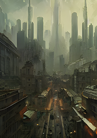

* [Hello Everybody!](#hello_everybody)
* [Making a 3D card in Blender](#making_a_3d_card_in_blender)
* [Rendering A Card](#rendering_a_card)
* [Drag & Drop Cards](#drag_and_drop_cards)


---
## Hello Everybody! 🧟 {#hello_everybody}

Hi I'm **Martin Bustos** and I've been developing games for more than two decades for PC, consoles, online, etc (you can check the list in my [GitHub](https://github.com/FronkonGames) profile). I've worked in several videogame companies and even co-founded two of them.

I recently decided to leave the corporate environment and dedicate myself to making games that I feel like making and playing! Here I will be recording the progress of my first game as an indie developer: '**Kairos**' (_codename_).

The game engine will be [Unity](https://unity.com/) and I will build a modular framework to use it in future projects. This framework, which I've called '**Game:Work**', is available on my [GitHub](https://github.com/FronkonGames) under [MIT License](https://github.com/FronkonGames/GameWork-Core/blob/main/LICENSE.md).



The pilars of '**Game:Work**' is formed by two parts, the first '[Foundation](https://github.com/FronkonGames/GameWork-Foundation)' is a set of utilities and code extensions useful for game development. It has no architecture, so it can be used on any project. All its functions are supported by [Unit Tests](https://docs.unity3d.com/Manual/testing-editortestsrunner.html).

On top of this is '[Core](https://github.com/FronkonGames/GameWork-Core)' which is where the architecture of '**Game:Work**' is implemented, building on modularity, events and dependency injection.

With modules you can add functionality to '**Game:Work**'. Some of the ones I am developing are:

* [Scene](https://github.com/FronkonGames/GameWork-Scene): async scene loading.
* [Local Data](https://github.com/FronkonGames/GameWork-Local-Data): async load / save local data with compression, encryption and integrity check.
* [Tween](https://github.com/FronkonGames/GameWork-Tween): tween / easing.

A big part of the project I hope to separate it into modules and those that are useful for further development I will publish them with the same framework license.

Until next time... 
{.h4}

---
## Making A 3D Card In Blender 🃏 {#making_a_3d_card_in_blender}

The first thing a card game needs is... cards.

And why in 3D? It would be _easier_ to do it in 2D, but to have more options in terms of effects and also to differentiate from the rest I decided that my card game would be 3D.

I was going to need a 3D editor, and in my modest opinion [Blender](https://www.blender.org/) is unbeatable in quality / price.



Once installed, in an empty scene, I added a plane using the menu '**Add > Mesh > Plane**'.
To make it easier to handle, I set the top camera by pressing '**7**' on the numeric pad.



There is no standard size for a card. A Bridge card measures 57.15 x 88.9 mm, while a Poker card measures 62 x 88 mm. This size is known as [B8 in ISO 216](https://formaty.info/en/B8/). Since it is the best known, it is the size I will use.



However, I am not really interested in the size itself, but in the ratio between width and height or _aspect ratio_. In the case case of a Poker card is **0.7** (62 / 88).

To achieve that _aspect ratio_, with the plane selected, press '**S**' and then '**X**', and typing '**0.7**' (62 / 88) will get the _aspect ratio_ I'm looking for.



To round corners I use the '**Bevel**' modifier.



And to give it a little thickness the modifier '**Solidify**'.



Now I applied all the transformations pressing '**Ctrl+A**', so that the scale of the final geometry is 1.



And the modifiers.



It was time for the materials. But first I created some UV coordinates in the '**UV Editing**' tab and selecting a _cube projection_.



As its name indicates, this tool creates the coordinates by projecting a cube on the model.



It may not be the best option for rounded edges, but it is the easiest one. You can adjust the coordinates by hand using the window on the left.

In the '**Shading**' tab, I created three materials: 'FrontFace', 'BackFace' and 'Border'. I selected the front face and the 'FrontFace
the 'FrontFace' material, and clicked the '**Assign**' button to associate them.

With '**CONTROL + 7**' I switched to the back view and performed a similar operation.

To assign the border material, select the two faces and invert the selection.



Now it was only left to export to FBX to the Unity project.

The only change I made in the export options was in '**Apply Scalings**', which I set to '**FBX Units Scale**' so that in Unity would export the scale correctly.



Until next time... 
{.h4}

[Blender scene](img/kairos/card.blend)
{.h4}

---
## Rendering A Card 🖌️ {#rendering_a_card}




All art in this post have been generated by an AI and do not represent the final style of the game


As we saw in the [previous post](../making-a-3d-card-in-blender/), each card has three materials:

* **FrontFace**: the face where all the important information and the image representing the card will be.
* **BackFace**: the face that will be seen when the card is face down.
* **Border**: the border material of the card.

To be able to adjust to the maximum each one of these materials, I will create three custom shaders using the pipeline that the game will use: '[Universal RP](https://docs.unity3d.com/Packages/com.unity.render-pipelines.universal@12.1/manual/index.html)', specifically version 12.1.

The simplest shader of the three is the one that is in charge of drawing the border of the card, which only has to draw one color:

```c#
Shader "Card/Border"
{
  // Properties are options set per material,
  // exposed by the material inspector.
  Properties
  {
    // [MainColor] allow Material.color to use the correct properties.
    [MainColor] _BaseColor("Base Color", Color) = (1, 1, 1, 1)
  }

  // Subshaders allow for different behaviour and options for
  // different pipelines and platforms.
  SubShader
  {
    // These tags are shared by all passes in this sub shader.
    Tags { "RenderType" = "Opaque" "Queue" = "Geometry" "RenderPipeline" = "UniversalPipeline" }

    // Shaders can have several passes which are used to render
    // different data about the material. Each pass has it's own
    // vertex and fragment function and shader variant keywords.
    Pass
    {
      // Begin HLSL code
      HLSLPROGRAM
      
      // Register our programmable stage functions.
      #pragma vertex vert
      #pragma fragment frag

      // Include basics URP functions.
      #include "Packages/com.unity.render-pipelines.universal/ShaderLibrary/Core.hlsl"

      // This attributes struct receives data about the mesh we're
      // currently rendering. Data is automatically placed in
      // fields according to their semantic.
      struct Attributes
      {
        float4 vertex : POSITION;  // Position in object space.
      };

      // This struct is output by the vertex function and input to
      // the fragment function. Note that fields will be
      // transformed by the intermediary rasterization stage.
      struct Varyings
      {
        // This value should contain the position in clip space (which
        // is similar to a position on screen) when output from the
        // vertex function. It will be transformed into pixel position
        // of the current fragment on the screen when read from
        // the fragment function.      
        float4 position : SV_POSITION;
      };

      half4 _BaseColor;

      // The vertex function. This runs for each vertex on the mesh. It
      // must output the position on the screen each vertex should
      // appear at, as well as any data the fragment function will need.
      Varyings vert(Attributes input)
      {
        Varyings output = (Varyings)0;
        
        // These helper functions transform object space values into
        // world and clip space.        
        const VertexPositionInputs positionInputs = GetVertexPositionInputs(input.vertex.xyz);
        
        // Pass position data to the fragment function.
        output.position = positionInputs.positionCS;
        
        return output;
      }

      // The fragment function. This runs once per fragment, which
      // you can think of as a pixel on the screen. It must output
      // the final color of this pixel.
      half4 frag(const Varyings input) : SV_Target
      {
        return _BaseColor;
      }
      ENDHLSL
    }
  }
}
```

To check that everything goes well, I will create three materials with the above shader, each one of a color and assign it to each material on the card.



It looks like everything is correct.

The next shader in difficulty would be the one for the back face. In it I want to mix two textures, one for the background image and another one as a frame.

The texture of the frame must have a transparent zone (alpha equal to 0) that allows to see the background texture.

<center>
|                                     Background                                      |                                   Frame                                    |
| :---------------------------------------------------------------------------------: | :------------------------------------------------------------------------: |
|  |  |

</center><br>

To mix, or more precisely _interpolate_, both pixels I will use the function [lerp(x, y, s)](https://learn.microsoft.com/en-us/windows/win32/direct3dhlsl/dx-graphics-hlsl-lerp), which returns _x_ if _s_ is 0, _y_ if _s_ is 1 and a linearly interpolated value between _x_ and _y_ if the value of _s_ is between 0 and 1.

```c#
half3 pixel = lerp(image, frame, frame.a);
```

In this way if the transparency of the frame is 0, you will see the image, otherwise you will see the frame. And if it is something in between, we will see a mix between the two images.



This new shader would look like this.

```c#
Shader "Card/Back Side"
{
  Properties
  {
    // [MainTexture] allow Material.mainTexture to use
    // the correct properties.
    [MainTexture] _BaseMap("Image (RGB)", 2D) = "white" {}
    
    _FrameTex("Frame (RGBA)", 2D) = "white" {}
    _FrameColor("Frame Color", Color) = (0, 0, 0, 1)
  }

  SubShader
  {
    Tags { "RenderType" = "Opaque" "Queue" = "Geometry" "RenderPipeline" = "UniversalPipeline" }

    Pass
    {
      HLSLPROGRAM
      #pragma vertex vert
      #pragma fragment frag

      #include "Packages/com.unity.render-pipelines.universal/ShaderLibrary/Core.hlsl"
      #include "Packages/com.unity.render-pipelines.universal/ShaderLibrary/SurfaceInput.hlsl"

      struct Attributes
      {
        float4 vertex : POSITION;
        float2 uv     : TEXCOORD0; // Material texture UVs.
      };

      struct Varyings
      {
        float4 position : SV_POSITION;
        float2 uv       : TEXCOORD0; // Material texture UVs.
      };

      // This is automatically set by Unity.
      // Used in TRANSFORM_TEX to apply UV tiling.
      float4 _BaseMap_ST;

      // Defines the Frame texture, sampler and color.
      // _BaseMap is already defined in SurfaceInput.hlsl.
      TEXTURE2D(_FrameTex);
      SAMPLER(sampler_FrameTex);
      float4 _FrameColor;
      
      Varyings vert(Attributes input)
      {
        Varyings output = (Varyings)0;

        const VertexPositionInputs positionInputs = GetVertexPositionInputs(input.vertex.xyz);
        output.position = positionInputs.positionCS;
        output.uv = TRANSFORM_TEX(input.uv, _BaseMap);

        return output;
      }

      half4 frag(Varyings input) : SV_Target
      {
        // Sample the textures.
        const half4 image = SAMPLE_TEXTURE2D(_BaseMap, sampler_BaseMap, input.uv);
        const half4 frame = SAMPLE_TEXTURE2D(_FrameTex, sampler_FrameTex, input.uv) * _FrameColor;

        // Interpolates between image and frame according
        // to the transparency of the frame.
        half4 pixel = lerp(image, frame, frame.a);

        return pixel;
      }
      ENDHLSL
    }
  }
}
```

The shader for the front part of the card, in a first version, is similar to the previous one but with another layer. It consists of three layers, that from more to less depth are:

* **Background**: the background of the card.
* **Image**: the image that represents the card.
* **Frame**: the border of the card.

<center>

|                                      Background                                       |                                 Image                                  |                                    Frame                                    |
| :-----------------------------------------------------------------------------------: | :--------------------------------------------------------------------: | :-------------------------------------------------------------------------: |
|  |  |  |

</center><br>

In addition to defining the new texture, in the 'frag' function you will have to add one more '**lerp**':

```c#
  // Sample the textures.
  const half4 image = SAMPLE_TEXTURE2D(_BaseMap, sampler_BaseMap, input.uv);
  const half4 background = SAMPLE_TEXTURE2D(_BackgroundTex, sampler_BackgroundTex, input.uv);
  const half4 frame = SAMPLE_TEXTURE2D(_FrameTex, sampler_FrameTex, input.uv);

  // Interpolates between image and background according to
  // the transparency of the frame.
  half4 pixel = lerp(background, image, image.a);

  // And the result is interpolated with the frame
  // transparency.
  pixel = lerp(pixel, frame, frame.a);

  return pixel;
```



And why separate the background from the image when they could be a single texture and save a texture fetch? you might be asking yourself.

And you would be right, since a texture fetch (the '**SAMPLE_TEXTURE2D**' macro) is one of the most expensive operations in shaders.

The answer is that we can add effects **behind** the image representing the card and **in front** of it.

The first effect we are going to see is the transformation of the UV coordinates. In particular, the displacement of these, with which we will achieve the rain effect and the fog effect that you saw at the beginning of this post.

These effects depend on the type of UV mapping your geometry uses. In my case, as we saw in the [previous post](../making-a-3d-card-in-blender/), I use a cubic projection so if I modify one axis of the coordinates I know that the texture will be displaced on one axis.

You can do a simple test by creating a cube in a scene and assigning a material to it. You can modify the UV coordinates of the material by changing its '**Offset**'.


I'm going to add two more textures to the shader. One between '**background**' and '**image**' and another between '**image**' and '**frame**'. In total we would have these layers:



It will be in these two new textures where I will apply a displacement in their UV coordinates. We only have to modify the UV coordinates in the macro **SAMPLE_TEXTURE2D**. If '**_Offset**' were a vector with the offset, it would be applied like this:

```c#
float2 newUV = input.uv + _Offset;

const half4 image = SAMPLE_TEXTURE2D(_BackgroundFXTex, sampler_BackgroundFXTex, newUV);
```

But instead of specifying a displacement, I will use a linear velocity vector. I will calculate the final displacement by multiplying this velocity by the time. The time is provided by Unity in the vector '[**_Time**](https://docs.unity3d.com/Manual/SL-UnityShaderVariables.html)', its coordinate __y__ being the unscaled time. If '**_ScrollVelocity**' were a vector with the linear velocity, it would be applied like this:

```c#
float2 newUV = input.uv + frac(_ScrollVelocity * _Time.y);

const half4 image = SAMPLE_TEXTURE2D(_BackgroundFXTex, sampler_BackgroundFXTex, newUV);
```

As the UV coordinates are between 0 and 1, with the function '[**frac**](https://learn.microsoft.com/windows/win32/direct3dhlsl/dx-graphics-hlsl-frac)' we will use only the decimal part to add it to these coordinates.

By using two effect layers, one behind the image and one in front of it, we can give each layer a different speed to simulate depth by making the farthest layer slower.

To create a rain effect I will use a rain texture that is '**seamless**', that is, that you don't notice a cut when you move it. It is important that you use a texture format that allows the transparency channel to have more than one bit of color (not like the PNG format). In my case I used a TGA.



The final effect would look something like this:



By changing the texture to a fog texture, and scrolling on the horizontal axis we can get a fog effect like this:



Finally it remains to add something fundamental, text. For this we will use [TextMeshPro](https://docs.unity3d.com/Manual/com.unity.textmeshpro.html), since it provides much better quality and options than the text offered by Unity. To install it just add it using the 'Package Manager'.



I added a child and added a 3D text.



And adjust the Z coordinate to be slightly ahead of the card.



And _voalá_!



That's all for now. In next posts I will add other effects that can be useful for a card game. In the meantime you can add some small improvements like:

* One color for each layer to tint it. You would only have to multiply the result of **SAMPLE_TEXTURE2D** by that color.
* Scaling. Simply multiplying by a scalar the UV coordinate.
* Angular velocity, to rotate the layers of the effects.
* Use different [blending functions](https://photoshoptrainingchannel.com/blending-modes-explained/) for the effect layers. In this post I have only used a simple way to blend the layers, but there are many blending functions that can give interesting results.
* And... can you think of anything else? I'd love to read about it in the comments.

Until next time... 
{.h4}

[Back Side Shader](https://gist.github.com/FronkonGames/78f2d00334b7aa8d3a3564b6c62f4fe7)
[Front Side Shader](https://gist.github.com/FronkonGames/c1e4c12b41612f72b84c6ed68076fb49)
[Border Shader](https://gist.github.com/FronkonGames/6b419e60eb42d81666bf35f18c59ab00)
{.h4}

<br>


In these shaders I have prioritized readability over optimization


Until next time... 
{.h4}

---
## Drag & Drop Cards 🃏 {#drag_and_drop_cards}




All art in this post have been generated by an AI and do not represent the final style of the game


Now that I have defined [visually a card](../rendering-a-card/), the next thing to do is to move it around the scene.

To do this we first have to detect the cards. We will do this using the '**Raycast**' functions, which __fire__ rays that when colliding with an object give us information about it.

Since it is a performance consuming operation, we will use some tricks to optimize it. The first one is that we will create a [layer](https://docs.unity3d.com/Manual/use-layers.html) to discard objects that are not involved in the operation. We will named it '__DragAndDrop__'.



We will also limit the ray length to the maximum distance our camera sees, since as a general rule we are not interested in objects we are not going to see. This distance is '__Camera.main.farClipPlane__'.

Since the '**Raycast**' operation is going to be used inside the '**Update**' loop (it is going to be executed every frame), it is always a good idea to avoid allocating memory if we can avoid it. So we will create a [Ray](https://docs.unity3d.com/ScriptReference/Ray.html) and use the function [Physics.RaycastNonAlloc](https://docs.unity3d.com/ScriptReference/Physics.RaycastNonAlloc.html).

The code to detect the cards would look something like this:

```c#
  // Layer of the objects to be detected.
  [SerializeField]
  private LayerMask raycastMask;

  // How many impacts of the beam we want to obtain.
  private const int HitsCount = 5;

  // Information on the impacts of shooting a ray.
  private readonly RaycastHit[] raycastHits = new RaycastHit[HitsCount];
  
  // Ray created from the camera to the projection of the mouse
  // coordinates on the scene.
  private Ray mouseRay;

  /// <summary>
  /// Returns the Transfrom of the object closest to the origin
  /// of the ray.
  /// </summary>
  /// <returns>Transform or null if there is no impact.</returns>
  private Transform MouseRaycast()
  {
    Transform hit = null;

    // Fire the ray!
    if (Physics.RaycastNonAlloc(mouseRay,
                                raycastHits,
                                Camera.main.farClipPlane,
                                raycastMask) > 0)
    {
      // We order the impacts according to distance.
      System.Array.Sort(raycastHits,
                        (x, y) => x.distance.CompareTo(y.distance));


      // We are only interested in the first one.
      hit = raycastHits[0].transform;
    }

    return hit;
  }  
```

Before calling this function, we must update '__mouseRay__' with the mouse coordinates. We will do it with this code:

```c#
  mouseRay = Camera.main.ScreenPointToRay(Input.mousePosition);
```


In this post I will use the old [Input](https://docs.unity3d.com/ScriptReference/Input.html) for simplicity, but it is recommended to use the new [Input System](https://docs.unity3d.com/Packages/com.unity.inputsystem@1.4/manual/QuickStartGuide.html).


In order to get all this to work on a card, we must first add a '[Collider](https://docs.unity3d.com/ScriptReference/Collider.html)'. Without this component, our ray would pass through the card without detecting it. A '[Box Collider](https://docs.unity3d.com/Manual/class-BoxCollider.html)' is a good choice for the type of geometry of a card, but if you need more precision you can use a '[Mesh Collider](https://docs.unity3d.com/Manual/class-MeshCollider.html)'.

The second thing to do is to assign the '__layer__' we have selected to the chart. We are now ready to detect a card.



Now we can start moving our cards. First we are going to define two interfaces, the first one is **IDrag**, for objects that you can drag.

```c#
/// <summary>
/// Draggable object.
/// </summary>
public interface IDrag
{
  /// <summary> Can it be draggable? </summary>
  public bool IsDraggable { get; }

  /// <summary> A Drag operation is currently underway. </summary>
  public bool Dragging { get; set; }
  
  /// <summary> Mouse enters the object. </summary>
  /// <param name="position">Mouse position.</param>
  public void OnPointerEnter(Vector3 position);
  
  /// <summary> Mouse exits object. </summary>
  /// <param name="position">Mouse position.</param>
  public void OnPointerExit(Vector3 position);

  /// <summary> Drag begins. </summary>
  /// <param name="position">Mouse position.</param>
  public void OnBeginDrag(Vector3 position);

  /// <summary>A drag is being made. </summary>
  /// <param name="deltaPosition"> Mouse offset position. </param>
  /// <param name="droppable">
  /// Object on which a drop may be made, or null. </param>
  public void OnDrag(Vector3 deltaPosition, IDrop droppable);

  /// <summary> The drag operation is completed. </summary>
  /// <param name="position">Mouse position.</param>
  /// <param name="droppable">
  /// Object on which a drop may be made, or null. </param>
  public void OnEndDrag(Vector3 position, IDrop droppable);
}
```

And the second is **IDrop**, for objects that can accept IDrag objects.

```c#
/// <summary>
/// Accept draggable objects.
/// </summary>
public interface IDrop
{
  /// <summary> Is it droppable? </summary>
  public bool IsDroppable { get; }

  /// <summary> Accept an IDrag? </summary>
  /// <param name="drag">Object IDrag.</param>
  /// <returns>Accept or not the object.</returns>
  public bool AcceptDrop(IDrag drag);

  /// <summary> Performs the drop operation of an IDrag object. </summary>
  /// <param name="drag">Object IDrag.</param>
  public void OnDrop(IDrag drag);
}
```

As you can see, it is **IDrop** that will authorize an **IDrag**, with its **AcceptDrop** method, whether or not to accept a drop operation to be executed on it.

With these two interfaces ready we can start with the one in charge of handling the drag and drop operations of our cards. We can call it '**DragAndDropManager**' and will be a [MonoBehaviour](https://docs.unity3d.com/ScriptReference/MonoBehaviour.html). An operation of drag & drop operation can be divided into:

1. There is no drag operation at present.
  - Cards must be detected under the mouse pointer.
    - If a card is detected and the left mouse button is pressed, a drag operation is started and the **OnBeginDrag** method must be called.
    - If there is a detected card and no button is being pressed, the **OnPointerEnter** and **OnPointerExit** methods of the detected card are called.
2. A drag operation is in progress.
  - If the left mouse button is pressed, the card should be moved and the **OnDrag** method should be called.
  - If it is not, the drag operation must be finished and the **OnEndDrag** method must be called.


All the code in this article is designed to move the cards in the XZ plane and use the Y axis for the height. If you use different axes you will have to modify the code.


All this will have to be done in each frame, so it will be done inside the function '**Update**' of '**DragAndDropManager**'. We will use these variables:

```c#
// Height at which we want the card to be in a drag operation.
[SerializeField, Range(0.0f, 10.0f)]
private float height = 1.0f;

// Object to which we are doing a drag operation
// or null if no drag operation currently exists.
private IDrag currentDrag;

// IDrag objects that the mouse passes over.
private IDrag possibleDrag;

// To know the position of the drag object.
private Transform currentDragTransform;

// To calculate the mouse offset (in world-space).
private Vector3 oldMouseWorldPosition;
```

Let's see how to detect an **IDrag**.

```c#
/// <summary>Detects an IDrag object under the mouse.</summary>
/// <returns>IDrag or null.</returns>
public IDrag DetectDraggable()
{
  IDrag draggable = null;

  mouseRay = Camera.main.ScreenPointToRay(Input.mousePosition);

  Transform hit = MouseRaycast();
  if (hit != null)
  {
    draggable = hit.GetComponent<IDrag>();
    if (draggable is { IsDraggable: true })
      currentDragTransform = hit;
    else
      draggable = null;
  }

  return draggable;
}
```

Now there are two possibilities, that the left mouse button is pressed or not pressed. If it is pressed and there is an **IDrag** object under the mouse pointer:

```c#
IDrag draggable = DetectDraggable();

// Left mouse button pressed?
if (Input.GetMouseButtonDown(0) == true)
{
  // Is there an IDrag object under the mouse pointer?
  if (draggable != null)
  {
    // We already have an object to start the drag operation!
    currentDrag = draggable;
    currentDragTransform = hit;
    oldMouseWorldPosition = MousePositionToWorldPoint();
    
    // Hide the mouse icon.
    Cursor.visible = false;
    // And we lock the movements to the window frame,
    // so we can't move objects out of the camera's view.
    Cursor.lockState = CursorLockMode.Confined;

    // The drag operation begins.
    currentDrag.Dragging = true;
    currentDrag.OnBeginDrag(new Vector3(raycastHits[0].point.x,
                                        raycastHits[0].point.y + height,
                                        raycastHits[0].point.z));
  }
}
```

And if the left mouse button is not pressed:

```c#
// Left mouse button not pressed?
if (Input.GetMouseButtonDown(0) == false)
{
  // We pass over a new IDrag?
  if (draggable != null && possibleDrag == null)
  {
    // We execute its OnPointerEnter.
    possibleDrag = draggable;
    possibleDrag.OnPointerEnter(raycastHits[0].point);
  }

  // We are leaving an IDrag?
  if (draggable == null && possibleDrag != null)
  {
    // We execute its OnPointerExit.
    possibleDrag.OnPointerExit(raycastHits[0].point);
    possibleDrag = null;
  }
}
```

We already have the first part, now let's go for the second part: to handle a drag operation. The first thing we will do is a new method that will return the **IDrop** that is under a card. It's not as simple as '**DetectDraggable()**', since a card has a surface and can be on several objects at once. We will need to cast four rays, one for each corner. And to choose one, we will order the
hits by proximity to the center of the card, this way we will get the **IDrop** object that is on the card and is the closest to it.

We will store the rays hits in an array:

```c#
// Information on impacts from the corners of a card.
private readonly RaycastHit[] cardHits = new RaycastHit[4];
```

And this is the method to search for the nearest IDrop:

```c#
/// <summary>Detects an IDrop object under the mouse.</summary>
/// <returns>IDrop or null.</returns>
private IDrop DetectDroppable()
{
  IDrop droppable = null;

  // The four corners of the card.
  Vector3 position = currentDragTransform.position;
  Vector2 halfSize = cardSize * 0.5f;
  Vector3[] cardConner =
  {
    new(position.x + halfSize.x, position.y, position.z - halfSize.y),
    new(position.x + halfSize.x, position.y, position.z + halfSize.y),
    new(position.x - halfSize.x, position.y, position.z - halfSize.y),
    new(position.x - halfSize.x, position.y, position.z + halfSize.y)
  };

  int cardHitIndex = 0;
  cardHits.Clear();

  // We launch the four rays.
  for (int i = 0; i < cardConner.Length; ++i)
  {
    Ray ray = new(cardConner[i], Vector3.down);
    if (Physics.RaycastNonAlloc(ray,
                                raycastHits,
                                Camera.main.farClipPlane,
                                raycastMask) > 0)
    {
      // We order the impacts by distance from the origin of the ray.
      System.Array.Sort(raycastHits, (x, y) =>
        x.distance.CompareTo(y.distance));

      // We are only interested in the closest one.
      cardHits[cardHitIndex++] = raycastHits[0];
    }
  }

  if (cardHitIndex > 0)
  {
    // We are looking for the nearest possible IDrop.
    System.Array.Sort(cardHits, (x, y) =>
      x.distance.CompareTo(y.distance));

    droppable = cardHits[0].transform.GetComponent<IDrop>();
  }

  return droppable;
}
```

Let's see it in action:



We can now proceed to the part where we handle a drag operation:

```c#
if (currentDrag != null)
{
  IDrop droppable = DetectDroppable();

  // Is the left mouse button held down?
  if (Input.GetMouseButton(0) == true)
  {
    // Calculate the offset of the mouse with respect
    // to its previous position.
    Vector3 mouseWorldPosition = MousePositionToWorldPoint();
    Vector3 offset = mouseWorldPosition - oldMouseWorldPosition;
    offset *= dragSpeed;

    // OnDrag is executed.
    currentDrag.OnDrag(offset, droppable);

    oldMouseWorldPosition = mouseWorldPosition;
  }
  else if (Input.GetMouseButtonUp(0) == true)
  {
    // The left mouse button is released and
    // the drag operation is finished.
    currentDrag.Dragging = false;
    currentDrag.OnEndDrag(raycastHits[0].point, droppable);
    currentDrag = null;
    currentDragTransform = null;

    // We return the mouse icon to its normal state.
    Cursor.visible = true;
    Cursor.lockState = CursorLockMode.None;
  }  
}
```

We already have the complete manager, but if you look at the code it doesn't actually move anything. That's because it's the __IDrag__ objects that are responsible for doing it. Let's see how they would be an object __IDrag__, which in our case is a card.

```c#
/// <summary> Card Drag. </summary>
[RequireComponent(typeof(Collider))]
public sealed class CardDrag : MonoBehaviour, IDrag
{
  public bool IsDraggable { get; private set; } = true;

  public bool Dragging { get; set; }

  // Position when the Drag starts.
  private Vector3 dragOriginPosition;  

  // Unused for the moment.
  public void OnPointerEnter(Vector3 position) { }
  public void OnPointerExit(Vector3 position)  { }

  /// <summary> Drag begins. </summary>
  /// <param name="position">Mouse position.</param>
  public void OnBeginDrag(Vector3 position)
  {
    // We store the current position, so that in case
    // the drag operation is not completed, the card
    // will return to its original position.
    dragOriginPosition = transform.position;

    // We raise the card to the height indicated by 'position'.
    transform.position = new Vector3(transform.position.x,
                                     position.y,
                                     transform.position.z);
  }

  /// <summary>A drag is being made. </summary>
  /// <param name="deltaPosition"> Mouse offset position. </param>
  /// <param name="droppable">Object on which a drop may be made, or null.</param>
  public void OnDrag(Vector3 deltaPosition, IDrop droppable)
  {
    // We ignore the displacement of the height.
    deltaPosition.y = 0.0f;

    // We move the card.
    transform.position += deltaPosition;
  }

  /// <summary> The drag operation is completed. </summary>
  /// <param name="position">Mouse position.</param>
  /// <param name="droppable">Object on which a drop may be made, or null.</param>
  public void OnEndDrag(Vector3 position, IDrop droppable)
  {
    // The IDrop object is active and accepts IDrag.
    if (droppable is { IsDroppable: true } &&
        droppable.AcceptDrop(this) == true)
      transform.position = new Vector3(transform.position.x,
                                       position.y,
                                       transform.position.z);
    else
      // There was no drop, we return to the original position.
      transform.position = dragOriginPosition;
  }
}
```


Remember that I am moving cards that do not have physics. In the case of objects with physics (with the [RigidBody](https://docs.unity3d.com/es/2019.4/Manual/class-Rigidbody.html) component), the correct way to move them is using '[RigidBody.MovePosition](https://docs.unity3d.com/ScriptReference/Rigidbody.MovePosition.html)' if it is [Kinematic](https://docs.unity3d.com/ScriptReference/Rigidbody-isKinematic.html), or using '[RigidBody.AddForce](https://docs.unity3d.com/ScriptReference/Rigidbody.AddForce.html)' if it is not.


We also need an __IDrop__ object that will accept our traveling card. It is as simple as this:

```c#
/// <summary>
/// Accept draggable objects.
/// </summary>
public class DroppableFloor : MonoBehaviour, IDrop
{
  public bool IsDroppable => true;

  // We accept all IDrags.
  public bool AcceptDrop(IDrag drag) => true;

  public void OnDrop(IDrag drag) { }
}
```

Let's take a look at a successful drag operation.



And now one that does not, since one of the corners collides with an __IDrag__ (another card) and this one is closer to the __IDrop__ (the ground).



We already have the basics. Now let's improve it a bit. The first thing we can do is change the way we pick up and drop the cards. Now they do it instantly,
they __teleport__ to the position we tell them to. Instead we can use the velocity formula (velocity = space / time) to move with constant velocity the cards.
We would have something like this:



Better, but still doesn't give a good feeling. Objects in real life do not reach a speed at instance, they have [inertia](https://en.wikipedia.org/wiki/Inertia). To make it similar in a simple way we can use [Easing functions](https://easings.net/), functions that interpolate values (values, vectors, colors, etc) using different curves.



There are many libraries with these functions. You may be interested in using my '[Tiny Tween](https://gist.github.com/FronkonGames/ae3d0d613ac4ea6738e288c0a490c020)', a simple to use library, very complete and in **one file**.

Let's change the way we pick up cards, using '[Tiny Tween](https://gist.github.com/FronkonGames/ae3d0d613ac4ea6738e288c0a490c020)' to raise it to the height we want in a natural way.

```c#
public void OnBeginDrag(Vector3 position)
{
  dragOriginPosition = transform.position;

  // While the card is being lifted, we do not want it to be draggable.
  IsDraggable = false;

  // We create a Tween to change the height of the card.
  TweenFloat.Create()
    .Origin(dragOriginPosition.y)   // Origin.
    .Destination(position.y)        // Destination.
    .Duration(riseDuration)         // Duration.
    .EasingIn(riseEaseIn)           // Initial Easing function.
    .EasingOut(riseEaseOut)         // Final Easing function.
    // This is where the position is modified.
    .OnUpdate(tween => transform.position =
      new Vector3(transform.position.x,
                  tween.Value,      // Only the height.
                  transform.position.z))
    .OnEnd(_ => IsDraggable = true) // When finished,
                                    // it becomes draggable again.
    .Start();
}
```

And this would be the result:



Much better! And only adding one file! ;)

Let's apply the same change to how the card moves. Right now it's very static, it looks like it's moving in a vacuum. We can exaggerate the friction of a flexible object moving in the air and rotate the cards depending on their direction and speed. You may have seen this effect in games such as '[Hearthstone](https://hearthstone.blizzard.com/)'.

We are going to modify the angles of the card according to its velocity vector. Specifically we will change the __pitch__ and __roll__.



Each axis will have a __force__ that will be applied to modify that axis. We will also limit the __range__ of the angles. And finally a time that will be the time it takes for the axes to return to their original value.

```c#
[Header("Pitch")]

[SerializeField, Label("Force")]
private float pitchForce = 10.0f;  

[SerializeField, Label("Minimum Angle")]
private float pitchMinAngle = -25.0f;  

[SerializeField, Label("Maximum Angle")]
private float pitchMaxAngle = 25.0f;  

[Space]

[Header("Roll")]

[SerializeField, Label("Force")]
private float rollForce = 10.0f;  

[SerializeField, Label("Minimum Angle")]
private float rollMinAngle = -25.0f;  

[SerializeField, Label("Maximum Angle")]
private float rollMaxAngle = 25.0f;  

[Space]

[SerializeField]
private float restTime = 1.0f;  

// Pitch angle and velocity.
private float pitchAngle, pitchVelocity;

// Roll angle and velocity.
private float rollAngle, rollVelocity;

// To calculate the velocity vector.
private Vector3 oldPosition;

// The original rotation
private Vector3 originalAngles;
```

In each frame we must calculate:

- The velocity vector, or offset, of the card.
- Calculate the pitch and roll depending on each axis and its force (__pitchForce__ and __rollForce__).
- Limit the angles to the valid ranges.
- Calculate the angles and over time (__restTime__) tend to zero.
- Apply the angles to the rotation of the card.

The offset vector is very simple, just subtract the current position from the position of the previous frame.

```c#
Vector3 currentPosition = transform.position;
Vector3 offset = currentPosition - oldPosition;

...

oldPosition = currentPosition;
```

To rule out small vibrations, we will only calculate the angles when the modulus of __offset__ is greater than [Mathf.Epsilon](https://docs.unity3d.com/ScriptReference/Mathf.Epsilon.html) (which is a value very close to zero). And since we don't care about the actual value of the modulus, we will use [Vector3.sqrMagnitude](https://docs.unity3d.com/ScriptReference/Vector3-sqrMagnitude.html) to avoid calculating a square root.

```c#
if (offset.sqrMagnitude > Mathf.Epsilon)
{
  pitchAngle = Mathf.Clamp(pitchAngle + offset.z * pitchForce,
                           pitchMinAngle,
                           pitchMaxAngle);
  rollAngle = Mathf.Clamp(rollAngle + offset.x * rollForce,
                          rollMinAngle,
                          rollMaxAngle);
}
```

We already have the value of each angle, now we want that little by little those values tend to be at rest (__restTime__). To do it we will use the function [Mathf.SmoothDamp](https://docs.unity3d.com/ScriptReference/Mathf.SmoothDamp.html) that also smooths the changes.


```c#
pitchAngle = Mathf.SmoothDamp(pitchAngle,
                              0.0f,
                              ref pitchVelocity,
                              restTime * Time.deltaTime * 10.0f);
rollAngle = Mathf.SmoothDamp(rollAngle,
                             0.0f,
                             ref rollVelocity,
                             restTime * Time.deltaTime * 10.0f);
```

And now we only have to apply the angles to the rotation of the card.

```c#
transform.rotation = Quaternion.Euler(originalAngles.x + pitchAngle,
                                      originalAngles.y,
                                      originalAngles.z - rollAngle);
```

Let's see the result.



Nice! That's all for now. In next posts we will see some useful objects for a card game such as: decks, slot, etc. In the meantime you can add some improvements like:

* Choose which Easing functions to use to pick up cards and drop them. I am using Quart/Back to pick them up and Quart/Bounce to drop them.
* Add some dust particles when dropping a card.
* Add a camera shake when dropping a card to give it more drama.
* And... can you think of anything else? I'd love to read about it in the comments.

Until next time... 
{.h4}

[Drag and Drop source code](https://gist.github.com/FronkonGames/e14d6f02fe90df7a2e212b11ee2f0a3c)
{.h4}
