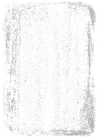




All art in this post have been generated by an AI and do not represent the final style of the game


As we saw in the [previous post](#making_a_3d_card_in_blender), each card has three materials:

* **FrontFace**: the face where all the important information and the image representing the card will be.
* **BackFace**: the face that will be seen when the card is face down.
* **Border**: the border material of the card.

To be able to adjust to the maximum each one of these materials, I will create three custom shaders using the pipeline that the game will use: '[Universal RP](https://docs.unity3d.com/Packages/com.unity.render-pipelines.universal@12.1/manual/index.html)', specifically version 12.1.

The simplest shader of the three is the one that is in charge of drawing the border of the card, which only has to draw one color:

```c#
Shader "Card/Border"
{
  // Properties are options set per material,
  // exposed by the material inspector.
  Properties
  {
    // [MainColor] allow Material.color to use the correct properties.
    [MainColor] _BaseColor("Base Color", Color) = (1, 1, 1, 1)
  }

  // Subshaders allow for different behaviour and options for
  // different pipelines and platforms.
  SubShader
  {
    // These tags are shared by all passes in this sub shader.
    Tags { "RenderType" = "Opaque" "Queue" = "Geometry" "RenderPipeline" = "UniversalPipeline" }

    // Shaders can have several passes which are used to render
    // different data about the material. Each pass has it's own
    // vertex and fragment function and shader variant keywords.
    Pass
    {
      // Begin HLSL code
      HLSLPROGRAM
      
      // Register our programmable stage functions.
      #pragma vertex vert
      #pragma fragment frag

      // Include basics URP functions.
      #include "Packages/com.unity.render-pipelines.universal/ShaderLibrary/Core.hlsl"

      // This attributes struct receives data about the mesh we're
      // currently rendering. Data is automatically placed in
      // fields according to their semantic.
      struct Attributes
      {
        float4 vertex : POSITION;  // Position in object space.
      };

      // This struct is output by the vertex function and input to
      // the fragment function. Note that fields will be
      // transformed by the intermediary rasterization stage.
      struct Varyings
      {
        // This value should contain the position in clip space (which
        // is similar to a position on screen) when output from the
        // vertex function. It will be transformed into pixel position
        // of the current fragment on the screen when read from
        // the fragment function.      
        float4 position : SV_POSITION;
      };

      half4 _BaseColor;

      // The vertex function. This runs for each vertex on the mesh. It
      // must output the position on the screen each vertex should
      // appear at, as well as any data the fragment function will need.
      Varyings vert(Attributes input)
      {
        Varyings output = (Varyings)0;
        
        // These helper functions transform object space values into
        // world and clip space.        
        const VertexPositionInputs positionInputs = GetVertexPositionInputs(input.vertex.xyz);
        
        // Pass position data to the fragment function.
        output.position = positionInputs.positionCS;
        
        return output;
      }

      // The fragment function. This runs once per fragment, which
      // you can think of as a pixel on the screen. It must output
      // the final color of this pixel.
      half4 frag(const Varyings input) : SV_Target
      {
        return _BaseColor;
      }
      ENDHLSL
    }
  }
}
```

To check that everything goes well, I will create three materials with the above shader, each one of a color and assign it to each material on the card.



It looks like everything is correct.

The next shader in difficulty would be the one for the back face. In it I want to mix two textures, one for the background image and another one as a frame.

The texture of the frame must have a transparent zone (alpha equal to 0) that allows to see the background texture.

<center>
|                                     Background                                      |                                   Frame                                    |
| :---------------------------------------------------------------------------------: | :------------------------------------------------------------------------: |
|  |  |

</center><br>

To mix, or more precisely _interpolate_, both pixels I will use the function [lerp(x, y, s)](https://learn.microsoft.com/en-us/windows/win32/direct3dhlsl/dx-graphics-hlsl-lerp), which returns _x_ if _s_ is 0, _y_ if _s_ is 1 and a linearly interpolated value between _x_ and _y_ if the value of _s_ is between 0 and 1.

```c#
half3 pixel = lerp(image, frame, frame.a);
```

In this way if the transparency of the frame is 0, you will see the image, otherwise you will see the frame. And if it is something in between, we will see a mix between the two images.



This new shader would look like this.

```c#
Shader "Card/Back Side"
{
  Properties
  {
    // [MainTexture] allow Material.mainTexture to use
    // the correct properties.
    [MainTexture] _BaseMap("Image (RGB)", 2D) = "white" {}
    
    _FrameTex("Frame (RGBA)", 2D) = "white" {}
    _FrameColor("Frame Color", Color) = (0, 0, 0, 1)
  }

  SubShader
  {
    Tags { "RenderType" = "Opaque" "Queue" = "Geometry" "RenderPipeline" = "UniversalPipeline" }

    Pass
    {
      HLSLPROGRAM
      #pragma vertex vert
      #pragma fragment frag

      #include "Packages/com.unity.render-pipelines.universal/ShaderLibrary/Core.hlsl"
      #include "Packages/com.unity.render-pipelines.universal/ShaderLibrary/SurfaceInput.hlsl"

      struct Attributes
      {
        float4 vertex : POSITION;
        float2 uv     : TEXCOORD0; // Material texture UVs.
      };

      struct Varyings
      {
        float4 position : SV_POSITION;
        float2 uv       : TEXCOORD0; // Material texture UVs.
      };

      // This is automatically set by Unity.
      // Used in TRANSFORM_TEX to apply UV tiling.
      float4 _BaseMap_ST;

      // Defines the Frame texture, sampler and color.
      // _BaseMap is already defined in SurfaceInput.hlsl.
      TEXTURE2D(_FrameTex);
      SAMPLER(sampler_FrameTex);
      float4 _FrameColor;
      
      Varyings vert(Attributes input)
      {
        Varyings output = (Varyings)0;

        const VertexPositionInputs positionInputs = GetVertexPositionInputs(input.vertex.xyz);
        output.position = positionInputs.positionCS;
        output.uv = TRANSFORM_TEX(input.uv, _BaseMap);

        return output;
      }

      half4 frag(Varyings input) : SV_Target
      {
        // Sample the textures.
        const half4 image = SAMPLE_TEXTURE2D(_BaseMap, sampler_BaseMap, input.uv);
        const half4 frame = SAMPLE_TEXTURE2D(_FrameTex, sampler_FrameTex, input.uv) * _FrameColor;

        // Interpolates between image and frame according
        // to the transparency of the frame.
        half4 pixel = lerp(image, frame, frame.a);

        return pixel;
      }
      ENDHLSL
    }
  }
}
```

The shader for the front part of the card, in a first version, is similar to the previous one but with another layer. It consists of three layers, that from more to less depth are:

* **Background**: the background of the card.
* **Image**: the image that represents the card.
* **Frame**: the border of the card.

<center>

|                                      Background                                       |                                 Image                                  |                                    Frame                                    |
| :-----------------------------------------------------------------------------------: | :--------------------------------------------------------------------: | :-------------------------------------------------------------------------: |
|  |  |  |

</center><br>

In addition to defining the new texture, in the 'frag' function you will have to add one more '**lerp**':

```c#
  // Sample the textures.
  const half4 image = SAMPLE_TEXTURE2D(_BaseMap, sampler_BaseMap, input.uv);
  const half4 background = SAMPLE_TEXTURE2D(_BackgroundTex, sampler_BackgroundTex, input.uv);
  const half4 frame = SAMPLE_TEXTURE2D(_FrameTex, sampler_FrameTex, input.uv);

  // Interpolates between image and background according to
  // the transparency of the frame.
  half4 pixel = lerp(background, image, image.a);

  // And the result is interpolated with the frame
  // transparency.
  pixel = lerp(pixel, frame, frame.a);

  return pixel;
```



And why separate the background from the image when they could be a single texture and save a texture fetch? you might be asking yourself.

And you would be right, since a texture fetch (the '**SAMPLE_TEXTURE2D**' macro) is one of the most expensive operations in shaders.

The answer is that we can add effects **behind** the image representing the card and **in front** of it.

The first effect we are going to see is the transformation of the UV coordinates. In particular, the displacement of these, with which we will achieve the rain effect and the fog effect that you saw at the beginning of this post.

These effects depend on the type of UV mapping your geometry uses. In my case, as we saw in the [previous post](#rendering_a_card), I use a cubic projection so if I modify one axis of the coordinates I know that the texture will be displaced on one axis.

You can do a simple test by creating a cube in a scene and assigning a material to it. You can modify the UV coordinates of the material by changing its '**Offset**'.


I'm going to add two more textures to the shader. One between '**background**' and '**image**' and another between '**image**' and '**frame**'. In total we would have these layers:



It will be in these two new textures where I will apply a displacement in their UV coordinates. We only have to modify the UV coordinates in the macro **SAMPLE_TEXTURE2D**. If '**_Offset**' were a vector with the offset, it would be applied like this:

```c#
float2 newUV = input.uv + _Offset;

const half4 image = SAMPLE_TEXTURE2D(_BackgroundFXTex, sampler_BackgroundFXTex, newUV);
```

But instead of specifying a displacement, I will use a linear velocity vector. I will calculate the final displacement by multiplying this velocity by the time. The time is provided by Unity in the vector '[**_Time**](https://docs.unity3d.com/Manual/SL-UnityShaderVariables.html)', its coordinate __y__ being the unscaled time. If '**_ScrollVelocity**' were a vector with the linear velocity, it would be applied like this:

```c#
float2 newUV = input.uv + frac(_ScrollVelocity * _Time.y);

const half4 image = SAMPLE_TEXTURE2D(_BackgroundFXTex, sampler_BackgroundFXTex, newUV);
```

As the UV coordinates are between 0 and 1, with the function '[**frac**](https://learn.microsoft.com/windows/win32/direct3dhlsl/dx-graphics-hlsl-frac)' we will use only the decimal part to add it to these coordinates.

By using two effect layers, one behind the image and one in front of it, we can give each layer a different speed to simulate depth by making the farthest layer slower.

To create a rain effect I will use a rain texture that is '**seamless**', that is, that you don't notice a cut when you move it. It is important that you use a texture format that allows the transparency channel to have more than one bit of color (not like the PNG format). In my case I used a TGA.



The final effect would look something like this:



By changing the texture to a fog texture, and scrolling on the horizontal axis we can get a fog effect like this:



Finally it remains to add something fundamental, text. For this we will use [TextMeshPro](https://docs.unity3d.com/Manual/com.unity.textmeshpro.html), since it provides much better quality and options than the text offered by Unity. To install it just add it using the 'Package Manager'.



I added a child and added a 3D text.



And adjust the Z coordinate to be slightly ahead of the card.



And _voalá_!



That's all for now. In next posts I will add other effects that can be useful for a card game. In the meantime you can add some small improvements like:

* One color for each layer to tint it. You would only have to multiply the result of **SAMPLE_TEXTURE2D** by that color.
* Scaling. Simply multiplying by a scalar the UV coordinate.
* Angular velocity, to rotate the layers of the effects.
* Use different [blending functions](https://photoshoptrainingchannel.com/blending-modes-explained/) for the effect layers. In this post I have only used a simple way to blend the layers, but there are many blending functions that can give interesting results.
* And... can you think of anything else? I'd love to read about it in the comments.

Until next time... 
{.h4}

[Back Side Shader](https://gist.github.com/FronkonGames/78f2d00334b7aa8d3a3564b6c62f4fe7)
[Front Side Shader](https://gist.github.com/FronkonGames/c1e4c12b41612f72b84c6ed68076fb49)
[Border Shader](https://gist.github.com/FronkonGames/6b419e60eb42d81666bf35f18c59ab00)
{.h4}

<br>


In these shaders I have prioritized readability over optimization


Until next time... 
{.h4}
