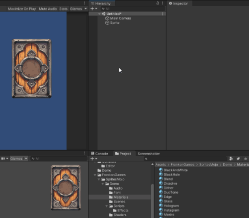



## Editor

From the editor you can create '**Sprites Mojo**' effects in two different ways: creating sprites and creating materials.

To create a sprite that uses one of the '**Sprites Mojo**' effects, right click on the '_Hierarchy_' window and select an effect from the list that will appear under '_2D Object > Sprites Mojo_'.



This will create an empty sprite with a '**Sprites Mojo**' material. When you assign a sprite (__1__) you will see the effect. '**Sprites Mojo**' is material based, so you will have to display its material (__2__) to see its parameters.



All effects have a layout similar to the example above. A first part (__3__) with the effect parameters. Another part that you can activate to adjust the color (__4__) and another part where you can adjust sprite values (__5__).

Finally, by clicking on '[doc]' (__6__) you can access the online documentation and by clicking on the '_Reset_' button (__7__) you will set all the parameters to their original values.

This is the easiest way to create sprites using '**Sprites Mojo**', but you must keep in mind that it will create a new material for each sprite you create. If your sprites do not share textures between them, no problem. If your sprites share the same texture, the second way is more optimal: creating materials.

To create a material that uses a '**Sprites Mojo**' effect, just right click on the '_Project_' window and select one of the '_Create > Sprites Mojo_' effects. Once the material is created, you only have to assign it to the sprites you want to use it.

<center>

</center>

## Code

All the code is inside the _namespace_ '__FronkonGames.SpritesMojo__'. The first thing to do is to import the _namespace_:

```csharp
 using FronkonGames.SpritesMojo;
```

You can create sprites that use the effects of '**Sprites Mojo**' as follows (in this example '__Retro__'):

```csharp
GameObject gameObject = Retro.CreateSprite();
```

Remember that each sprite will have a new material. If you want several sprites to use the same material with an effect, you can create it that way and then assign it to the sprites you want:

```csharp
Material material = Retro.CreateMaterial();
```

Each effect has those two functions (_CreateSprite()_ and _CreateMaterial()_) to create its own sprites and materials. You can find them all in the '_Fronkon Games/SpritesMojo/Runtime_' folder.

Continuing with the previous example, if you wanted to modify or query any parameter of the '__Retro__' effect, you can do it like this:

```csharp
SpriteRenderer sprite = gameObject.GetComponent<SpriteRenderer>();

// Changes the sprite emulation mode.
Retro.Mode.Set(sprite, Retro.Emulations.Gameboy);

// Check pixelation.
int pixelation = Retro.Pixelation.Get(sprite);

// You can also do it with the material.
Retro.Mode.Set(material, Retro.Emulations.Gameboy);
float luminance = Retro.Luminance.Get(material);
```

In addition, all effects have some common parameters that you can access through the '_SpritesMojo_' class that you can find in '_Fronkon Games/Sprites Mojo/Runtime_'. For example, let's enable '_ColorAdjust_' if it is disabled and modify some of its parameters:

```csharp
if (SpriteMojo.ColorAdjust.Get(sprite) == false)
{
  SpriteMojo.ColorAdjust.Set(sprite, true);

  SpriteMojo.Gamma.Set(sprite, 1.2f);
  SpriteMojo.Hue.Set(sprite, 0.25f);
}
```

All effect variables of type _IntVariable_, _FloatVariable_, _ColorVariable_ and _VectorVariable_ can be set to a value and you can specify how long (in seconds) you want the transition to last from the current value to the one you have set. For example, if you want to transition to a pixel size of 8 in 2 seconds:

```
Retro.Pixelation.Set(sprite, 8, 2.0f);
```

Check the class comments for more information.

---
#
## Effects

### Black and White

Desaturates the image by selecting the intensity for each color channel, the amount of light and the smoothness of the color change.





### Black Hole

Create a '_black hole_' inside the sprite. Use the alpha channel of '_Color_' to modify the transparency of the effect.






This effect modifies the outline of the sprite, in some cases you may notice some bugs in the edges. To fix it, make sure that in the sprite import options '__Mesh Type__' is set to '__Full Rect__'. This effect does not support [Sprite Atlas](https://docs.unity3d.com/Manual/class-SpriteAtlas.html).


### Blend

Use some of Photoshop's 25 blending modes.






Since URP does not support '[Grab Pass](https://docs.unity3d.com/Manual/SL-GrabPass.html)' at the moment, this effect is only available for the Built-in Render Pipeline.


### Dissolve

'_Dissolve_' the sprite using a gradient texture as a pattern. Change the mode to '_Color_' to make a border appear with the color of your choice, or use '_Texture_' to make it a texture.

This effect has a large list of built-in patterns you can use, but if you want to use your own, select '_Custom_' under '_Shape_'. This way you can specify the texture you want to use.






This effect does not support [Sprite Atlas](https://docs.unity3d.com/Manual/class-SpriteAtlas.html).


### Dither

Applies various algorithms to reduce the amount of colors. It also pixelizes the sprite.





### Duo Tone

It uses a two-color gradient based on the sprite's luminance. To adjust the brightness ranges it uses, you can press the '_Auto_' button or adjust it manually in 'Luminance'.





### Edge

Highlight sprite edges using different modes and algorithms.





### Glass

Simulates a glass material, deforming the background.






Since URP does not support '[Grab Pass](https://docs.unity3d.com/Manual/SL-GrabPass.html)' at the moment, this effect is only available for the Built-in Render Pipeline.


### Hologram

It simulates a hologram or projection.





### Instagram

Apply one of the 15 most used filters on Instagram.





### Masks

Applies blending effects, colors and textures to areas of a sprite defined by a mask. The mask is a texture in which you can define up to 3 zones, one for each color channel.






This effect does not support [Sprite Atlas](https://docs.unity3d.com/Manual/class-SpriteAtlas.html).


### Negative

Change each color by its opposite. You can define how each color channel is affected.





### Outline

Creates a border around the sprite outline.





### Pinch

Clamp the sprite in a certain area.






This effect modifies the outline of the sprite, in some cases you may notice some bugs in the edges. To fix it, make sure that in the sprite import options '__Mesh Type__' is set to '__Full Rect__'.


### Ramp

Replaces the sprite colors with a gradient of 5 colors based on luminance. To adjust the luminance ranges it uses, you can click the 'Auto' button or adjust it manually in 'Luminance'.





To easily find a gradient, click on '__search__' (__1__), to open the gradient search tool (internet connection required), or click on '__random__' (__2__) to get a random one.



Clicking on '__sort__' (__3__) will sort the gradient colors from the darkest (in '_Color 1_') to the brightest (in '_Color 5_'). You can also '__copy__' '__paste__' (__4__) between sprites with the '__Ramp__' effect.

### Retro

Emulates old devices such as: Gameboy, Commodore 64, ZX Spectrum, etc.





### RGB Glitch

Simulates a failure in the RGB color channels.






This effect modifies the outline of the sprite, in some cases you may notice some bugs in the edges. To fix it, make sure that in the sprite import options '__Mesh Type__' is set to '__Full Rect__'.


### Shake

Shake the sprite.






This effect modifies the outline of the sprite, in some cases you may notice some bugs in the edges. To fix it, make sure that in the sprite import options '__Mesh Type__' is set to '__Full Rect__'.


### Shift

Shitfs the RGB color channels linearly or radially. Enable '__Noise__' to add noise to the scroll.






This effect modifies the outline of the sprite, in some cases you may notice some bugs in the edges. To fix it, make sure that in the sprite import options '__Mesh Type__' is set to '__Full Rect__'.


### Swirl

Twist a certain area of the sprite.






This effect modifies the outline of the sprite, in some cases you may notice some bugs in the edges. To fix it, make sure that in the sprite import options '__Mesh Type__' is set to '__Full Rect__'. This effect does not support [Sprite Atlas](https://docs.unity3d.com/Manual/class-SpriteAtlas.html).


### Tremor

Causes tremors in the sprite.






This effect modifies the outline of the sprite, in some cases you may notice some bugs in the edges. To fix it, make sure that in the sprite import options '__Mesh Type__' is set to '__Full Rect__'.


### Trio Tone

It uses a three-color gradient based on the sprite's luminance. To adjust the luminance ranges it uses, you can click the '_Auto_' button or adjust it manually in 'Luminance'.





---
#
## Support

Do you have any problem or any suggestions? Send me an email to **fronkongames@gmail.com** and I'll be happy to help you.

Remember that if you want to inform me of an error, it would help me if you sent to me the [log file](https://docs.unity3d.com/Manual/LogFiles.html).


<br><center><h4>



If you are happy with this asset, consider write a review in the store

❤️ thanks! ❤️



</center></h4>

